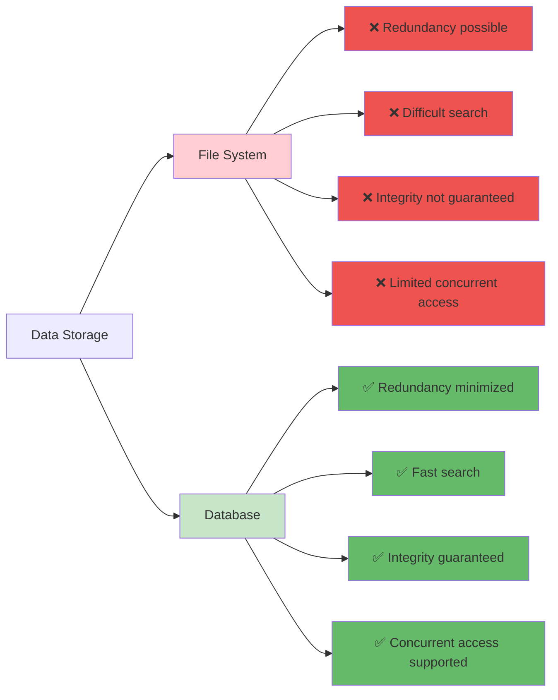
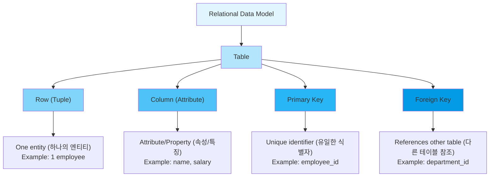
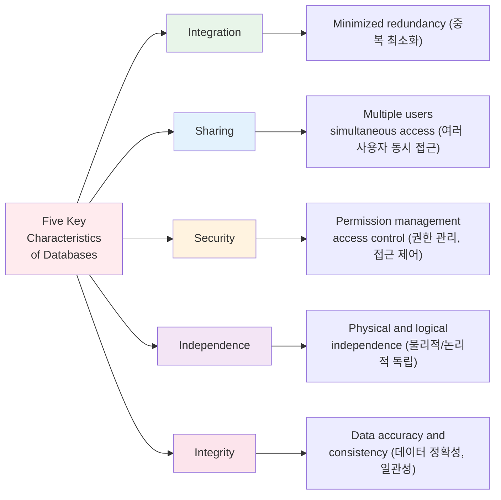

# Chapter 1. Database Overview and Learning Environment Setup

---

## 📋 Class Overview

**Class Topic**: Understanding the Concepts of Databases and Building a MySQL Environment (데이터베이스의 개념 이해 및 MySQL 환경 구축)

**Learning Objectives** (수업 목표)

- Understand the difference between databases and file systems (데이터베이스와 파일 시스템의 차이 이해)
- Learn the basic concepts of relational databases (관계형 데이터베이스의 기본 개념 습득)
- Install MySQL and build a basic environment (MySQL 설치 및 기본 환경 구축)
- Understand real-world applications of databases (데이터베이스의 실제 활용 사례 이해)

**Required Materials** (준비물)

- Windows/Mac/Linux Operating System
- MySQL Installation File
- MySQL Workbench
- Internet Connection

---

## 📚 Part 1: Theoretical Learning

### What You'll Learn in This Section

This section begins with the most fundamental concepts of databases. You will clearly understand the differences between data, information, and database, and learn the differences between file systems and databases. Additionally, by understanding the structure of relational databases, the characteristics of MySQL, and the role of DBMS, you will establish a theoretical foundation for subsequent practical exercises.

이 섹션에서는 데이터베이스의 가장 기본적인 개념부터 시작합니다. 데이터(Data), 정보(Information), 데이터베이스(Database)의 차이를 명확히 이해하고, 파일 시스템과 데이터베이스의 차이점을 학습합니다. 또한 관계형 데이터베이스의 구조와 MySQL의 특징, 그리고 DBMS의 역할을 이해함으로써 이후 실습을 위한 이론적 기초를 다집니다.

### 1-1. Concepts of Databases

#### **Data vs Information vs Database**

```
Data (데이터)
├─ Definition: Facts or numerical values collected from the real world (현실 세계로부터 수집한 사실이나 수치)
├─ Example: Student ID 202401001, Name "John Smith", GPA 3.8
└─ Characteristic: Simple facts, no meaning attached (단순한 사실, 의미 없음)

Information (정보)
├─ Definition: Data processed to have meaningful value (데이터를 처리하여 의미를 부여한 것)
├─ Example: "5 students from AI Software Engineering Department have GPA 3.8 or above"
└─ Characteristic: Meaningful, supports decision-making (의미 있음, 의사결정 도구)

Database (데이터베이스)
├─ Definition: A collection of data stored so that multiple users 
│              of a particular organization can share, operate, and manage
│              (특정 조직의 여러 사용자가 공유하고 운영할 수 있도록 저장된 데이터의 집합)
├─ Characteristic: Integration, Storage, Sharing, Operability (통합, 저장, 공유, 운영 가능)
└─ Purpose: Information generation, Decision support (정보 생성, 의사결정 지원)
```

#### **File System vs Database**

| Item | File System | Database |
| ------------------- | ---------------- | ---------------- |
| **Storage Method** | Individual files | Integrated data |
| **Redundancy** | High | Minimized |
| **Access Method** | Program-dependent | Independent |
| **Security** | Low | High |
| **Efficiency** | Low | High |
| **Concurrent Access** | Difficult | Easy |
| **Example** | Excel, CSV | MySQL, Oracle |

**Comparison Example**

Student Information Management in File System (파일 시스템에서의 학생 정보 관리):

- student_basic_info.csv
- student_grades.csv
- student_attendance.csv
  → Possible redundancy, consistency issues (중복 가능, 일관성 문제 발생)

Student Information Management in Database (데이터베이스에서의 학생 정보 관리):

- student table
  - student_id
  - name
  - gpa
  - attendance
    → Integrated management, redundancy eliminated (통합 관리, 중복 제거)



---

### 1-2. Relational Database Management Systems (RDBMS) Concepts

#### **What is RDBMS?**

```
RDBMS (Relational Database Management System)

Characteristics:
1. Tables composed of rows and columns (행과 열로 구성된 테이블)
2. Relationships established between tables (테이블 간 관계 설정)
3. Data manipulation through SQL statements (SQL 문으로 데이터 조작)
4. Data integrity guaranteed (데이터 무결성 보장)
5. Transaction processing supported (트랜잭션 처리 지원)
```

#### **Basic Terminology**

```
Table (테이블)
├─ Definition: A set of data organized in rows and columns (행과 열로 구성된 데이터 집합)
└─ Example: student (Student Information Table)

Row (행) = Record (레코드)
├─ Definition: One line of a table (테이블의 한 줄)
└─ Example: 202401001, John Smith, AI Software Engineering

Column (열) = Attribute (속성)
├─ Definition: One field/item of a table (테이블의 한 항목)
└─ Example: student_id, name, department

Primary Key (기본키)
├─ Definition: A column that uniquely identifies each row (각 행을 유일하게 식별하는 열)
└─ Example: student_id (No duplicates, No NULL values - 중복 불가, NULL 불가)

Foreign Key (외래키)
├─ Definition: References the primary key of another table (다른 테이블의 기본키를 참조)
└─ Example: professor_id in the course table
```



---

### 1-3. Introduction to MySQL

#### **What is MySQL?**

```
MySQL (My Structured Query Language)

Characteristics:
1. Open-source database (오픈소스 데이터베이스)
2. Free (commercial support available for fee - 무료, 상용 지원 유료)
3. High performance and stability (높은 성능과 안정성)
4. Widely used in web applications (웹 애플리케이션에 많이 사용)
5. Core component of LAMP/LEMP stack (LAMP/LEMP 스택의 핵심)

Versions:
- MySQL 5.7 (Legacy version - 이전 버전)
- MySQL 8.0 (Current standard - 현재 표준)
- MariaDB (MySQL-compatible open-source - MySQL 호환 오픈소스)

Why Choose MySQL:
✓ Easy to learn (배우기 쉬움)
✓ Simple installation (설치가 간단)
✓ Active community (커뮤니티가 활발)
✓ Industry standard (산업 표준)
✓ Widely used in Korea (한국에서도 많이 사용)
```

#### **Comparison with Other RDBMS**

| Characteristic | MySQL | Oracle | SQL Server | PostgreSQL |
| --------------------- | -------------- | ------------ | ------------ | ---------- |
| **Price** | Free | Very Expensive | Expensive | Free |
| **Learning Curve** | Easy | Difficult | Moderate | Moderate |
| **For Web Use** | Excellent | Enterprise | Enterprise | Good |
| **Market Share in Korea** | High | High | Moderate | Low |
| **Recommended For** | Beginners, Web | Large Corp | Large Corp | Developers |

---

### 1-4. Advantages of Databases

#### **Benefits of Database Implementation**

```
Advantage 1: Data Integrity (데이터 무결성)
├─ Prevents invalid data entry through constraints (제약조건으로 잘못된 데이터 입력 방지)
├─ Maintains data consistency (데이터 일관성 유지)
└─ Example: GPA allowed only between 0-4.5 (학점은 0~4.5 범위만 허용)

Advantage 2: Enhanced Security (보안성 향상)
├─ User permission management (사용자 권한 관리)
├─ Encryption support (암호화 지원)
└─ Access control (접근 제어)

Advantage 3: Data Sharing (데이터 공유)
├─ Multiple users accessing simultaneously (여러 사용자 동시 접근)
├─ Remote access through network (네트워크를 통한 원격 접근)
└─ Increased collaboration efficiency (협업 효율 증대)

Advantage 4: Performance Optimization (성능 최적화)
├─ Improved search speed through indexes (인덱스를 통한 검색 속도 향상)
├─ Query optimization (쿼리 최적화)
└─ Large-scale data processing (대용량 데이터 처리)

Advantage 5: Recovery Capability (복구 가능성)
├─ Backup and recovery functions (백업 및 복구 기능)
├─ Transaction processing (트랜잭션 처리)
└─ Disaster recovery (장애 복구)
```



---

### 1-5. Roles of Database Management Systems

```
Roles of DBMS

1. Data Definition (데이터 정의)
   └─ DDL: CREATE, ALTER, DROP

2. Data Manipulation (데이터 조작)
   └─ DML: SELECT, INSERT, UPDATE, DELETE

3. Data Control (데이터 제어)
   └─ DCL: GRANT, REVOKE

4. Data Integrity Management (데이터 무결성 관리)
   └─ Constraints, triggers (제약조건, 트리거)

5. Concurrency Control (동시성 제어)
   └─ Management of simultaneous user access (여러 사용자 동시 접근 관리)

6. Backup and Recovery (백업 및 복구)
   └─ Disaster preparation (장애 대비)
```

---

## 📚 Part 2: MySQL Installation and Environment Setup

### What You'll Learn in This Section

In this section, you will learn how to actually install MySQL and configure the basic environment. You will follow step-by-step installation procedures on Windows operating systems, execute MySQL Workbench, and verify that it operates correctly. This is a hands-on practice where you apply concepts learned in theory to a real environment.

이 섹션에서는 실제로 MySQL을 설치하고 기본 환경을 구성하는 방법을 배웁니다. Windows 운영체제에서의 설치 절차를 단계별로 따라가며, MySQL Workbench를 실행하여 정상적으로 작동하는지 확인합니다. 이론에서 배운 개념을 실제 환경에서 적용해보는 실습입니다.

### 2-1. MySQL Installation (Windows Example)

**Step 1: Download MySQL**

- Visit https://dev.mysql.com/downloads/mysql/
- Select MySQL 8.0 version (MySQL 8.0 버전 선택)
- Download Windows version (Windows 버전 다운로드)

**Step 2: Run Installation Program**

- Execute mysql-8.0.x-winx64.msi (mysql-8.0.x-winx64.msi 실행)
- Setup Type: Select Developer Default (Setup Type: Developer Default 선택)
- Confirm MySQL Server and MySQL Workbench are included (MySQL Server, MySQL Workbench 포함 확인)

**Step 3: Configuration**

- Port: 3306 (default - 기본값)
- Configuration Type: Development Machine (개발 머신)
- Authentication Method: MySQL 8.0 compatible (MySQL 8.0 호환)

**Step 4: Initial Setup**

- Set root user password (Root 사용자 비밀번호 설정)
- Confirm default port 3306 (기본 포트 3306 확인)
- Register as Windows Service (Windows Service로 등록)

**Step 5: Completion**

- Set MySQL server to auto-start (MySQL 서버 자동 시작 설정)
- Confirm MySQL Workbench installation (MySQL Workbench 설치 확인)

### 2-2. First Execution of MySQL Workbench

1. Launch MySQL Workbench (MySQL Workbench 실행)
2. Click on Local instance MySQL (Local instance MySQL 클릭)
3. Enter password (비밀번호 입력)
4. Confirm successful connection (연결 성공 확인)

---

## 💻 Part 3: Hands-on Practice

### What You'll Learn in This Section

In this section, you will verify that MySQL installation was successful and directly create the basic structure of databases and tables. By entering SQL commands to verify configurations and gaining basic experience in storing and querying actual data, you will develop practical foundational knowledge.

이 섹션에서는 MySQL 설치가 성공적으로 이루어졌는지 확인하고, 데이터베이스와 테이블의 기본 구조를 직접 만들어봅니다. SQL 명령어를 입력하여 설정을 확인하고, 실제로 데이터를 저장하고 조회하는 기초 경험을 얻게 됩니다.

### 3-1. Concept Verification Practice

**Practice 1-1: Verify MySQL Installation**

```sql
-- Check MySQL version (MySQL 버전 확인)
SELECT VERSION();

-- Check current database (현재 데이터베이스 확인)
SELECT DATABASE();

-- Check current user (현재 사용자 확인)
SELECT USER();

-- Check MySQL status (MySQL 상태 확인)
SHOW STATUS;
```

**Practice 1-2: Basic System Information**

```sql
-- List all databases (모든 데이터베이스 목록)
SHOW DATABASES;

-- Check MySQL port (MySQL 포트 확인)
SHOW VARIABLES LIKE 'port';

-- Check character set (문자셋 확인)
SHOW VARIABLES LIKE 'character_set%';
```

---

### 3-2. Basic Database and Table Creation Practice

**Practice 1-3: Create Database**

```sql
-- Create database (데이터베이스 생성)
CREATE DATABASE ch1_practice CHARACTER SET utf8mb4;

-- Select database (데이터베이스 선택)
USE ch1_practice;

-- Verify created database (생성된 데이터베이스 확인)
SHOW DATABASES;

-- Check current database (현재 데이터베이스 확인)
SELECT DATABASE();
```

**Practice 1-4: Create Basic Table**

```sql
-- Create student table (학생 테이블 생성)
CREATE TABLE student (
    student_id INT PRIMARY KEY,
    name VARCHAR(30) NOT NULL,
    department VARCHAR(30),
    gpa DECIMAL(3, 2)
) CHARACTER SET utf8mb4;

-- Check table structure (테이블 구조 확인)
DESC student;
SHOW CREATE TABLE student;

-- Check all tables (모든 테이블 확인)
SHOW TABLES;
```

**Practice 1-5: Insert Sample Data**

```sql
-- Insert data (데이터 입력)
INSERT INTO student VALUES
(202401001, 'John Smith', 'AI Software Engineering', 3.85),
(202401002, 'Emily Johnson', 'AI Software Engineering', 3.92),
(202401003, 'Sarah Williams', 'AI Software Engineering', 3.45);

-- Verify data (데이터 확인)
SELECT * FROM student;
```

---

### 3-3. Integrated Practice

**Practice 1-6: Complete Configuration Verification**

```sql
-- 1. Check current status (현재 상태 확인)
SELECT '=== MySQL Connection Status ===' AS info;
SELECT VERSION() AS MySQL_Version;
SELECT USER() AS Current_User;
SELECT DATABASE() AS Current_Database;

-- 2. Check table status (테이블 상태 확인)
SELECT '=== Table Information ===' AS info;
SHOW TABLES;
DESC student;

-- 3. Verify data (데이터 확인)
SELECT '=== Stored Data ===' AS info;
SELECT COUNT(*) AS Total_Students FROM student;
SELECT AVG(gpa) AS Average_GPA FROM student;
```

---

## 📝 Part 4: Assignment Guidelines

### Theoretical Assignments

**Assignment 1**: Explain the relationship between data and information, and provide examples from your daily life that apply this concept. For example, explain how data collected in a course registration system is transformed into information.

데이터와 정보의 관계를 설명하고, 일상 생활에서 이를 적용한 사례를 들어주세요. 예를 들어, 수강 신청 시스템에서 수집되는 데이터가 어떻게 정보로 변환되는지 설명하면 좋습니다.

**Assignment 2**: Describe the problems that arise when managing student information using a file system, and compare and analyze the improvements achieved when using a database.

파일 시스템을 이용하여 학생 정보를 관리하는 경우의 문제점을 설명하고, 데이터베이스를 사용했을 때의 개선 사항을 비교 분석하세요.

**Assignment 3**: Explain the characteristics of relational databases and provide reasons why MySQL is a representative example of a relational database.

관계형 데이터베이스의 특징을 설명하고, MySQL이 관계형 데이터베이스의 대표적인 예시인 이유를 설명하세요.

**Assignment 4**: Explain six major roles of DBMS and discuss how each role is important in actual business operations.

DBMS의 주요 역할 여섯 가지를 설명하고, 각각의 역할이 실제 업무에서 어떻게 중요한지 서술하세요.

**Assignment 5**: Explain five major advantages of database adoption and discuss how each advantage impacts an organization's competitiveness.

데이터베이스를 도입했을 때의 다섯 가지 주요 장점을 설명하고, 각 장점이 조직의 경쟁력에 어떤 영향을 미치는지 논의하세요.

**Submission Format**: Word or PDF document (1-2 pages)

---

### Practical Assignments

**Assignment 1**: Verify that MySQL has been installed successfully by executing basic commands such as SELECT VERSION(), SELECT USER(), SELECT DATABASE(), and attach screenshots of the results to prove installation completion.

SELECT VERSION(), SELECT USER(), SELECT DATABASE() 등의 기본 명령어를 실행하여 MySQL이 정상적으로 설치되었는지 확인하고, 그 결과를 스크린샷으로 첨부하여 설치 완료를 증명하세요.

**Assignment 2**: Create a new database named 'ch1_mydata' and verify that it was created properly using the SHOW DATABASES command, then attach the result screenshot.

ch1_mydata라는 이름의 새로운 데이터베이스를 생성하고, SHOW DATABASES 명령어로 생성된 데이터베이스를 확인한 후, 결과 스크린샷을 첨부하세요.

**Assignment 3**: Create a table named product within the ch1_mydata database with the following columns: product_id (integer, primary key), product_name (variable character, 50 characters), price (integer), stock (integer). Verify that the table was created correctly.

ch1_mydata 데이터베이스 내에 product라는 이름의 테이블을 다음 열들로 생성하세요. 열은 product_id (정수형, 기본키), product_name (가변 문자형 50자), price (정수형), stock (정수형)으로 구성되어야 합니다. 생성 후 테이블이 제대로 만들어졌는지 확인하세요.

**Assignment 4**: Query the structure of the product table using the DESC command to verify that all columns have been created correctly as designed, and submit the result as a screenshot.

product 테이블의 구조를 DESC 명령어로 조회하여 설계한 대로 모든 열이 올바르게 생성되었는지 확인하고, 그 결과를 스크린샷으로 제출하세요.

**Assignment 5**: Insert at least 3 or more product data into the product table. Each product must be a real, existing product, and prices and stock quantities must be realistic values. After inserting the data, use a SELECT statement to query all data to verify proper storage and attach the result as a screenshot.

product 테이블에 최소 3개 이상의 상품 데이터를 입력하세요. 각 상품은 실제 존재하는 상품이어야 하며, 가격과 재고량은 현실적인 수치여야 합니다. 데이터를 입력한 후 SELECT 문으로 모든 데이터를 조회하여 제대로 저장되었는지 확인하고 결과를 스크린샷으로 첨부하세요.

**Submission Format**: SQL file (Ch1_Practice_[StudentID].sql) and screenshot collection

---

Thank you for your attention.

Cho Jeonghyun (peterchokr@gmail.com). Yeungnam University College
