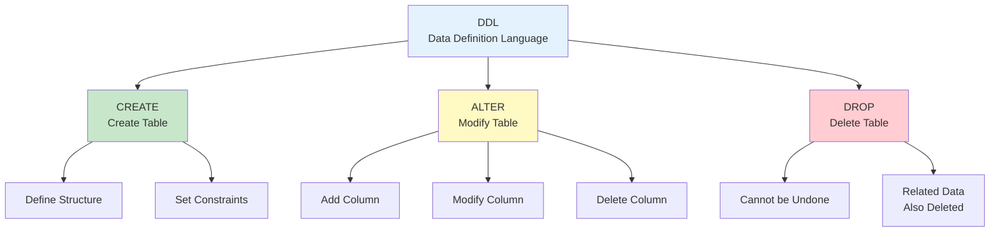

# Chapter 2. Database and Table Design

---

## 📋 Class Overview

**Class Topic**: Table Design Using DDL (Create, Alter, Drop)

**Learning Objectives** (수업 목표)

- Master the CREATE TABLE syntax (CREATE TABLE 문법 완벽 숙달)
- Understand data types and constraints (데이터타입 및 제약조건 이해)
- Modify tables using ALTER TABLE (ALTER TABLE로 테이블 수정)
- Design efficient databases (효율적인 데이터베이스 설계)

---

## 📚 Part 1: Theoretical Learning

### What You'll Learn in This Section

This section focuses on learning the core concepts of database design: data types and constraints. You will understand when each data type should be used and how constraints ensure data integrity. Additionally, you will master DDL commands such as CREATE TABLE and ALTER TABLE to learn how to design and modify tables in practice.

이 섹션에서는 데이터베이스 설계의 핵심인 데이터타입과 제약조건의 개념을 학습합니다. 각 데이터타입이 언제 사용되는지, 그리고 제약조건이 데이터 무결성을 어떻게 보장하는지를 이해합니다. 또한 CREATE TABLE, ALTER TABLE 등의 DDL 명령어를 익혀 실제로 테이블을 설계하고 수정하는 방법을 배웁니다.



### 2-1. Understanding Data Types

#### **Major Data Types**

```
Numeric Types (숫자형):
├─ INT: Integer (-2,147,483,648 ~ 2,147,483,647 - 정수)
├─ DECIMAL(5,2): Fixed-point number (3 digits.2 decimals - 부동소수점, 금액에 적합)
├─ FLOAT, DOUBLE: Floating-point numbers (부동소수점, 성능용)
└─ BIGINT: Large integer (큰 정수)

Character Types (문자형):
├─ VARCHAR(n): Variable-length characters (0~255 characters - 가변길이 문자, 권장)
├─ CHAR(n): Fixed-length characters (고정길이 문자, 낭비 가능)
├─ TEXT: Long text (긴 텍스트)
└─ ENUM: Predefined values only (정해진 값만)

Date/Time Types (날짜/시간):
├─ DATE: 2024-01-15
├─ TIME: 14:30:45
├─ DATETIME: 2024-01-15 14:30:45
└─ TIMESTAMP: Automatically recorded (자동 기록)

Other Types (기타):
├─ BOOLEAN: TRUE/FALSE
└─ BLOB: Binary data (이진 데이터, 사진, 파일)
```

### 2-2. Constraints

```
PRIMARY KEY (기본키)
├─ Uniquely identifies each row (각 행을 유일하게 식별)
├─ No duplicates, No NULL values (중복 불가, NULL 불가)
└─ Set in CREATE TABLE (CREATE TABLE에서 설정)

NOT NULL (필수값)
├─ Value must be provided (반드시 값이 있어야 함)
└─ Example: name, student ID (예: 이름, 학번)

UNIQUE (유일성)
├─ No duplicates (NULL is allowed - 중복 불가, NULL은 허용)
└─ Example: email, ID number (예: 이메일, 주민등록번호)

DEFAULT (기본값)
├─ Use default value if not entered (입력하지 않으면 기본값 사용)
└─ Example: sign-up date = CURDATE() (예: 가입일자 = CURDATE())

CHECK (조건 검사)
├─ Allow only values that satisfy the condition (조건을 만족하는 값만 허용)
└─ Example: age >= 0 (예: 나이 >= 0)

FOREIGN KEY (외래키)
├─ References primary key of another table (다른 테이블의 기본키 참조)
└─ Maintain referential integrity (참조 무결성 유지)
```

### 2-3. CREATE TABLE Syntax

```sql
CREATE TABLE table_name (
    column_name1 data_type [constraints],
    column_name2 data_type [constraints],
    PRIMARY KEY (column_name)
) CHARACTER SET utf8mb4;

Real Example (실제 예시):
CREATE TABLE employee (
    emp_id INT PRIMARY KEY AUTO_INCREMENT,
    emp_name VARCHAR(30) NOT NULL,
    department VARCHAR(20),
    salary DECIMAL(10,2),
    hire_date DATE DEFAULT (CURDATE()),
    CHECK (salary > 0)
) CHARACTER SET utf8mb4;
```

### 2-4. ALTER TABLE Syntax

```sql
-- Add column (열 추가)
ALTER TABLE table_name 
ADD column_name data_type;

-- Delete column (열 삭제)
ALTER TABLE table_name 
DROP COLUMN column_name;

-- Modify column (열 수정)
ALTER TABLE table_name 
MODIFY column_name new_data_type;

-- Change column name (열 이름 변경)
ALTER TABLE table_name 
CHANGE old_name new_name data_type;
```

---

## 📚 Part 2: Sample Table Design

### What You'll Learn in This Section

In this section, you will apply the learned data types and constraints to design actual tables. Through examples of department and employee tables, you will learn how to establish relationships between tables and define foreign keys. You will also insert sample data to verify that the designed table works correctly.

이 섹션에서는 배운 데이터타입과 제약조건을 실제로 적용하여 테이블을 설계합니다. department 테이블과 employee 테이블의 예시를 통해 테이블 간 관계를 설정하고, 외래키를 정의하는 방법을 배웁니다. 또한 샘플 데이터를 삽입하여 설계한 테이블이 제대로 작동하는지 확인합니다.

### 2-1. Create Database and Tables

```sql
-- Create database (데이터베이스 생성)
CREATE DATABASE ch2_design CHARACTER SET utf8mb4;
USE ch2_design;

-- Department table (부서 테이블)
CREATE TABLE department (
    dept_id INT PRIMARY KEY AUTO_INCREMENT,
    dept_name VARCHAR(30) NOT NULL UNIQUE,
    location VARCHAR(30),
    budget DECIMAL(15,2),
    CONSTRAINT check_budget CHECK (budget >= 0)
) CHARACTER SET utf8mb4;

-- Employee table (직원 테이블)
CREATE TABLE employee (
    emp_id INT PRIMARY KEY AUTO_INCREMENT,
    emp_name VARCHAR(30) NOT NULL,
    dept_id INT,
    position VARCHAR(20),
    salary DECIMAL(10,2),
    hire_date DATE DEFAULT (CURDATE()),
    phone VARCHAR(15),
    FOREIGN KEY (dept_id) REFERENCES department(dept_id),
    CONSTRAINT check_salary CHECK (salary > 0)
) CHARACTER SET utf8mb4;

-- Sample data (샘플 데이터)
INSERT INTO department VALUES
(1, 'Sales Team', 'Seoul', 100000000),
(2, 'Development Team', 'Pangyo', 150000000),
(3, 'Human Resources', 'Seoul', 50000000);

INSERT INTO employee VALUES
(1, 'John Smith', 1, 'Team Manager', 5000000, '2020-01-15', '010-1111-1111'),
(2, 'Emily Johnson', 2, 'Developer', 4000000, '2021-03-20', '010-2222-2222'),
(3, 'Sarah Park', 2, 'Developer', 3500000, '2022-06-10', '010-3333-3333');
```

---

## 💻 Part 3: Hands-on Practice

### What You'll Learn in This Section

In this section, you will execute the learned DDL commands to create and modify tables. You will apply various data types and constraints using CREATE TABLE and modify table structures using ALTER TABLE. Through this practice, you will develop practical database design skills.

이 섹션에서는 배운 DDL 명령어를 직접 실행하여 테이블을 만들고 수정해봅니다. CREATE TABLE을 사용하여 다양한 데이터타입과 제약조건을 적용하고, ALTER TABLE로 테이블 구조를 변경하는 실습을 하게 됩니다. 이를 통해 실제 데이터베이스 설계 능력을 기르게 됩니다.

### 3-1. Basic Table Creation Practice

**Practice 3-1: Create Simple Table**

```sql
-- Customer table (고객 테이블)
CREATE TABLE customer (
    customer_id INT PRIMARY KEY AUTO_INCREMENT,
    customer_name VARCHAR(30) NOT NULL,
    email VARCHAR(50) UNIQUE,
    phone VARCHAR(15),
    signup_date DATE DEFAULT (CURDATE())
) CHARACTER SET utf8mb4;

-- Verify (확인)
DESC customer;
SHOW CREATE TABLE customer;
```

**Practice 3-2: Table with Constraints**

```sql
-- Product table (상품 테이블)
CREATE TABLE product (
    product_id INT PRIMARY KEY AUTO_INCREMENT,
    product_name VARCHAR(50) NOT NULL,
    category VARCHAR(20),
    price INT,
    stock INT DEFAULT 0,
    CHECK (price > 0),
    CHECK (stock >= 0)
) CHARACTER SET utf8mb4;

-- Insert data (데이터 입력)
INSERT INTO product VALUES
(NULL, 'Laptop', 'Electronics', 1500000, 10),
(NULL, 'Mouse', 'Electronics', 50000, 50),
(NULL, 'Desk', 'Furniture', 300000, 5);
```

---

### 3-2. Table Modification Practice

**Practice 3-3: ALTER TABLE Practice**

```sql
-- Add columns to customer table (고객 테이블에 열 추가)
ALTER TABLE customer 
ADD address VARCHAR(100);

ALTER TABLE customer 
ADD grade VARCHAR(10) DEFAULT 'Silver';

-- Verify (확인)
DESC customer;

-- Modify column (열 수정)
ALTER TABLE customer 
MODIFY phone VARCHAR(20);

-- Delete column (열 삭제)
ALTER TABLE customer 
DROP COLUMN grade;
```

---

### 3-3. Integrated Design Practice

**Practice 3-4: Complete Database Design**

```sql
-- Order system design (주문 시스템 설계)

CREATE TABLE orders (
    order_id INT PRIMARY KEY AUTO_INCREMENT,
    customer_id INT NOT NULL,
    order_date DATETIME DEFAULT CURRENT_TIMESTAMP,
    total_amount DECIMAL(12,2),
    status VARCHAR(20) DEFAULT 'Order Received',
    FOREIGN KEY (customer_id) REFERENCES customer(customer_id),
    CHECK (total_amount > 0)
) CHARACTER SET utf8mb4;

CREATE TABLE order_detail (
    order_detail_id INT PRIMARY KEY AUTO_INCREMENT,
    order_id INT NOT NULL,
    product_id INT NOT NULL,
    quantity INT NOT NULL,
    price DECIMAL(10,2),
    FOREIGN KEY (order_id) REFERENCES orders(order_id),
    FOREIGN KEY (product_id) REFERENCES product(product_id),
    CHECK (quantity > 0)
) CHARACTER SET utf8mb4;

-- Verify table structure (테이블 구조 확인)
SHOW TABLES;
DESC orders;
DESC order_detail;
```

---

## 📝 Part 4: Assignment Guidelines

### Theoretical Assignments

**Assignment 1**: Explain the differences between VARCHAR(30) and CHAR(30) data types, and provide two examples where each is appropriately used. Also discuss the differences from a storage space efficiency perspective.

VARCHAR(30)과 CHAR(30) 데이터타입의 차이점을 설명하고, 각각이 적절하게 사용되는 사례를 두 가지씩 제시하세요. 저장 공간 효율성 관점에서도 논의하세요.

**Assignment 2**: Explain which data type should be chosen between DECIMAL(10,2) and FLOAT when storing monetary amounts, and compare and analyze the advantages and disadvantages of each data type.

금액을 저장할 때 DECIMAL(10,2)과 FLOAT 데이터타입 중 어느 것을 선택해야 하는지 설명하고, 각 데이터타입의 장단점을 비교 분석하세요.

**Assignment 3**: Explain the differences between PRIMARY KEY and UNIQUE constraints, and describe how to distinguish and apply these two constraints when designing a table with practical examples.

PRIMARY KEY와 UNIQUE 제약조건의 차이를 설명하고, 테이블 설계 시 이 두 제약조건을 어떻게 구분하여 적용해야 하는지 실무 사례를 들어 서술하세요.

**Assignment 4**: Explain the differences between applying NOT NULL and UNIQUE constraints together versus separately, and discuss the impact each has on data integrity.

NOT NULL 제약조건과 UNIQUE 제약조건을 함께 적용했을 때와 따로 적용했을 때의 차이점을 설명하고, 각각이 데이터 무결성에 미치는 영향을 논의하세요.

**Assignment 5**: Explain the role and importance of Foreign Keys, and describe potential data consistency issues that could occur without using foreign keys with specific examples.

외래키(FOREIGN KEY)의 역할과 중요성을 설명하고, 외래키를 사용하지 않았을 때 발생 가능한 데이터 일관성 문제를 사례를 들어 설명하세요.

**Submission Format**: Word or PDF document (1-2 pages)

---

### Practical Assignments

**Assignment 1**: Design a professor table that meets the following requirements and write the CREATE TABLE statement. The table should consist of professor number (integer, primary key, auto-increment - 교수번호: 정수형, 기본키, 자동증가), professor name (variable character 30 characters, required - 교수명: 가변 문자형 30자, 필수), department (variable character 20 characters - 학과: 가변 문자형 20자), position (variable character 20 characters - 직급: 가변 문자형 20자), salary (decimal 10 digits 2 decimals, only allows 0 or more - 급여: 십진수 10자리 2소수자리, 0 이상만 허용).

**Assignment 2**: Insert data for 5 or more professors into the professor table with realistic information. Each professor should have diverse departments and positions like those at actual universities.

professor 테이블에 5명 이상의 교수 데이터를 현실적인 정보로 입력하세요. 각 교수는 실제 대학교의 교수처럼 다양한 학과와 직급을 가져야 합니다.

**Assignment 3**: Use ALTER TABLE to add a new column called phone to the professor table. This column should be a variable character type for storing the professor's mobile phone number. After adding, verify the changes with the DESC command and attach the result as a screenshot.

ALTER TABLE 문을 사용하여 professor 테이블에 phone이라는 새로운 열을 추가하세요. 이 열은 교수의 휴대폰 번호를 저장하기 위한 가변 문자형이어야 합니다. 추가 후 DESC 명령어로 테이블 구조를 확인해 변경사항을 스크린샷으로 첨부하세요.

**Assignment 4**: Modify the salary column of the professor table to DECIMAL(12,2) to be able to store larger amounts. Use the ALTER TABLE MODIFY command to make the modification, then verify the changes were applied correctly using DESCRIBE or SHOW CREATE TABLE and submit the result as a screenshot.

professor 테이블의 salary 열을 DECIMAL(12,2)로 수정하여 더 큰 금액을 저장할 수 있도록 변경하세요. ALTER TABLE의 MODIFY 명령어를 사용하여 수정한 후 수정이 제대로 적용되었는지 DESCRIBE 또는 SHOW CREATE TABLE로 확인하고 결과를 스크린샷으로 제출하세요.

**Assignment 5**: Query the entire structure of the professor table you created with the DESC command to verify that all design requirements are accurately reflected. Attach the final table structure as a screenshot and briefly explain why each column's data type and constraints were designed as they were.

지금까지 생성한 professor 테이블의 전체 구조를 DESC 명령어로 조회하여 모든 설계 요구사항이 정확하게 반영되었는지 확인하세요. 최종적인 테이블 구조를 스크린샷으로 첨부하고, 각 열의 데이터타입과 제약조건이 왜 그렇게 설계되었는지 간단히 설명하세요.

**Submission Format**: SQL file (Ch2_Table_Design_[StudentID].sql)

---

Thank you for your attention.   
Cho Jeonghyun ([peterchokr@gmail.com](mailto:peterchokr@gmail.com)). Yeungnam University College

"Produced in collaboration with Claude and Gemini."
