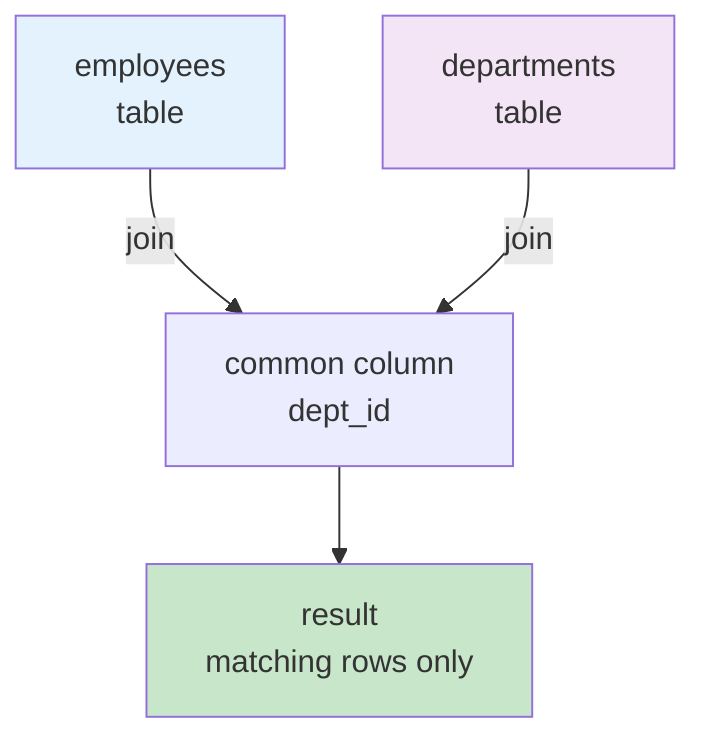
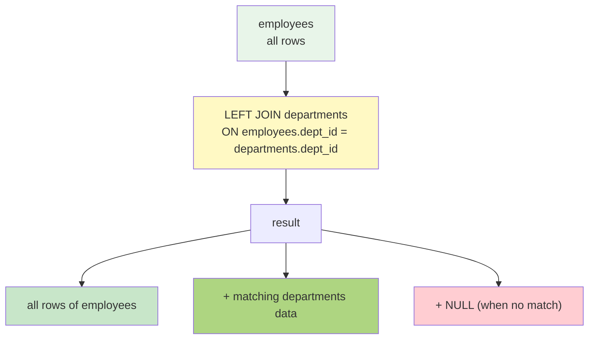

# Chapter 5. JOIN Operations - Basics

---

## 📋 Class Overview

**Class Topic**: Multi-Table Query Using INNER JOIN and LEFT JOIN (INNER JOIN과 LEFT JOIN을 이용한 다중 테이블 조회)

**Learning Objectives** (수업 목표)

- Understand the concept and necessity of JOIN (JOIN의 개념과 필요성 이해)
- Master INNER JOIN perfectly (INNER JOIN 완벽 숙달)
- Understand LEFT JOIN (LEFT OUTER JOIN) (LEFT JOIN (LEFT OUTER JOIN) 이해)
- Distinguish between ON clause and WHERE clause (ON 절과 WHERE 절의 차이 구분)

---

## 📚 Part 1: Theoretical Learning

### What You'll Learn in This Section

In this section, you will learn the concept of JOIN to query data separated into multiple tables due to database normalization. You will learn how to query data that exists in both tables using INNER JOIN, and how to connect data from another table while including all data from one table using LEFT JOIN. Through this, you will develop the ability to query multiple tables.

이 섹션에서는 데이터베이스 정규화로 인해 여러 테이블로 분리된 데이터를 조회하기 위한 JOIN의 개념을 배웁니다.    
INNER JOIN으로 양쪽 테이블에 모두 존재하는 데이터를 조회하고, LEFT JOIN으로 한쪽 테이블의 모든 데이터를 포함하면서 다른 테이블의 데이터를 연결하는 방법을 학습합니다. 이를 통해 다중 테이블 조회 능력을 기르게 됩니다.

### 1-1. Why JOIN is Necessary

Database normalization removes redundancy, separating data across multiple tables. To query data from multiple tables, JOIN is necessary. For example, when student information, enrollment information, and course information are stored in separate tables, you need to join these tables to query the courses a student took.

데이터베이스 정규화를 통해 중복을 제거한 여러 테이블의 데이터를 조회하기 위해 JOIN이 필요합니다. 예를 들어, 학생 정보와 수강 정보, 강좌 정보가 각각 다른 테이블에 저장되어 있을 때, 학생이 수강한 강좌를 조회하려면 이 테이블들을 연결해야 합니다.

### 1-2. INNER JOIN

INNER JOIN queries only data that exists in both tables.

INNER JOIN은 양쪽 테이블 모두에 존재하는 데이터만 조회합니다.

Basic Syntax (기본 문법):
```sql
SELECT * FROM table1
INNER JOIN table2
ON condition;
```



### 1-3. LEFT JOIN (LEFT OUTER JOIN)

LEFT JOIN queries all data from the left table and matching data from the right table. All rows from the left table are included, and NULL is displayed if there is no matching data in the right table.

LEFT JOIN은 왼쪽 테이블의 모든 데이터와 오른쪽 테이블의 일치하는 데이터를 조회합니다. 왼쪽 테이블의 모든 행이 포함되며, 오른쪽 테이블에 일치하는 데이터가 없으면 NULL이 표시됩니다.



### 1-4. ON Clause vs WHERE Clause

The ON clause specifies the condition for the JOIN and defines how to connect two tables. The WHERE clause applies additional filters to the JOIN result to include only desired rows in the final result.

ON 절은 JOIN의 조건을 지정하며, 두 테이블을 어떻게 연결할 것인지 정의합니다. WHERE 절은 JOIN 결과에 추가 필터를 적용하여 원하는 행만 최종 결과에 포함시킵니다.

---

## 📚 Part 2: Sample Data

### What You'll Learn in This Section

In this section, you will create four tables (professor, course, student, enrollment) used for JOIN practice and establish relationships. You will define relationships between tables through foreign keys of each table and insert sample data modeled after an actual academic management system.

이 섹션에서는 JOIN 실습에 사용할 네 개의 테이블(professor, course, student, enrollment)을 생성하고 관계를 설정합니다. 각 테이블의 외래키를 통해 테이블 간 관계를 정의하고, 실제 학사관리 시스템을 모델링한 샘플 데이터를 삽입합니다.

```sql
-- Create database (데이터베이스 생성)
CREATE DATABASE ch5_join CHARACTER SET utf8mb4;
USE ch5_join;

-- Create professor table (교수 테이블 생성)
CREATE TABLE professor (
    professor_id INT PRIMARY KEY AUTO_INCREMENT,
    professor_name VARCHAR(30) NOT NULL,
    department VARCHAR(30)
) CHARACTER SET utf8mb4;

-- Create course table (강좌 테이블 생성)
CREATE TABLE course (
    course_id INT PRIMARY KEY AUTO_INCREMENT,
    course_name VARCHAR(30) NOT NULL,
    credits INT,
    professor_id INT,
    FOREIGN KEY (professor_id) REFERENCES professor(professor_id)
) CHARACTER SET utf8mb4;

-- Create student table (학생 테이블 생성)
CREATE TABLE student (
    student_id INT PRIMARY KEY AUTO_INCREMENT,
    student_name VARCHAR(30) NOT NULL,
    major VARCHAR(30)
) CHARACTER SET utf8mb4;

-- Create enrollment table (수강 테이블 생성)
CREATE TABLE enrollment (
    enrollment_id INT PRIMARY KEY AUTO_INCREMENT,
    student_id INT,
    course_id INT,
    grade VARCHAR(2),
    FOREIGN KEY (student_id) REFERENCES student(student_id),
    FOREIGN KEY (course_id) REFERENCES course(course_id)
) CHARACTER SET utf8mb4;

-- Insert professor data (교수 데이터 삽입)
INSERT INTO professor VALUES
(1, 'Park Chulsu', 'AI Software Engineering'),
(2, 'Lee Younghee', 'AI Software Engineering'),
(3, 'Choi Junho', 'AI Software Engineering');

-- Insert course data (강좌 데이터 삽입)
INSERT INTO course VALUES
(1, 'Database', 3, 1),
(2, 'Web Programming', 3, 2),
(3, 'Artificial Intelligence', 3, 1),
(4, 'Cloud Computing', 3, 3);

-- Insert student data (학생 데이터 삽입)
INSERT INTO student VALUES
(1, 'Student A', 'AI Software Engineering'),
(2, 'Student B', 'AI Software Engineering'),
(3, 'Student C', 'Computer Science'),
(4, 'Student D', 'AI Software Engineering');

-- Insert enrollment data (수강 데이터 삽입)
INSERT INTO enrollment VALUES
(1, 1, 1, 'A'),
(2, 1, 2, 'B'),
(3, 2, 1, 'A'),
(4, 2, 3, 'B'),
(5, 3, 2, 'C'),
(6, 4, 1, 'A');
```

---

## 💻 Part 3: Hands-on Practice (30 Problems)

### What You'll Learn in This Section

In this section, you will execute the JOINs you learned and write various queries. You will start with practice connecting related data using INNER JOIN, and then practice including all data from one table using LEFT JOIN. You will also write complex queries that JOIN 3 or more tables and filter results with WHERE clauses, developing JOIN skills necessary for practical work.

이 섹션에서는 배운 JOIN을 실제로 실행하여 다양한 쿼리를 작성합니다. INNER JOIN으로 관련 데이터를 연결하는 실습부터 시작하여, LEFT JOIN으로 한쪽 테이블의 모든 데이터를 포함하는 실습을 하게 됩니다. 또한 3개 이상의 테이블을 JOIN하고 WHERE 절로 결과를 필터링하는 복잡한 쿼리도 작성하게 되어, 실무에서 필요한 JOIN 능력을 기르게 됩니다.

```sql
-- =====================================================
-- 3-1. INNER JOIN Practice (Basic) (INNER JOIN 실습 기본)
-- =====================================================
-- Practice 5-1~5-11: Basic INNER JOIN (기본 INNER JOIN)

-- 1. Query courses and instructor names (강좌와 담당 교수, 학점 조회)
SELECT c.course_name, p.professor_name, c.credits
FROM course c
INNER JOIN professor p ON c.professor_id = p.professor_id;

-- 2. Query students and their courses (학생과 수강한 강좌 조회)
SELECT s.student_name, c.course_name
FROM student s
INNER JOIN enrollment e ON s.student_id = e.student_id
INNER JOIN course c ON e.course_id = c.course_id;

-- 3. Query students, courses, and grades (학생, 강좌, 성적 조회 기본)
SELECT s.student_name, c.course_name, e.grade
FROM student s
INNER JOIN enrollment e ON s.student_id = e.student_id
INNER JOIN course c ON e.course_id = c.course_id;

-- 4. Count students per course (강좌별 수강 학생 수)
SELECT c.course_name, COUNT(e.student_id) AS enrollment_count
FROM course c
INNER JOIN enrollment e ON c.course_id = e.course_id
GROUP BY c.course_name;

-- 5. Query enrollments with grade A (성적이 A인 수강 내역 조회)
SELECT s.student_name, c.course_name, e.grade
FROM student s
INNER JOIN enrollment e ON s.student_id = e.student_id
INNER JOIN course c ON e.course_id = c.course_id
WHERE e.grade = 'A';

-- 6. Query courses taken by AI Software Engineering students (AI소프트웨어학과 학생의 수강 강좌)
SELECT s.student_name, c.course_name
FROM student s
INNER JOIN enrollment e ON s.student_id = e.student_id
INNER JOIN course c ON e.course_id = c.course_id
WHERE s.major = 'AI Software Engineering';

-- 7. Count courses per student (학생별 수강한 강좌 개수)
SELECT s.student_name, COUNT(e.course_id) AS courses_taken
FROM student s
INNER JOIN enrollment e ON s.student_id = e.student_id
GROUP BY s.student_name;

-- 8. Query students in Park's courses (박철수 교수의 강좌를 수강하는 학생)
SELECT DISTINCT s.student_name
FROM student s
INNER JOIN enrollment e ON s.student_id = e.student_id
INNER JOIN course c ON e.course_id = c.course_id
INNER JOIN professor p ON c.professor_id = p.professor_id
WHERE p.professor_name = 'Park Chulsu';

-- 9. Query Database course students and grades (데이터베이스 강좌를 수강하는 학생 및 성적)
SELECT s.student_name, e.grade
FROM student s
INNER JOIN enrollment e ON s.student_id = e.student_id
INNER JOIN course c ON e.course_id = c.course_id
WHERE c.course_name = 'Database';

-- 10. Query course enrollment list (정렬) (강좌별 수강생 목록 정렬)
SELECT c.course_name, s.student_name, e.grade
FROM course c
INNER JOIN enrollment e ON c.course_id = e.course_id
INNER JOIN student s ON e.student_id = s.student_id
ORDER BY c.course_name;

-- 11. Query students with B grade or higher (B학점 이상의 강좌 수강 학생)
SELECT DISTINCT s.student_name
FROM student s
INNER JOIN enrollment e ON s.student_id = e.student_id
WHERE e.grade IN ('A', 'B');

-- =====================================================
-- 3-2. LEFT JOIN Practice (LEFT JOIN 실습)
-- =====================================================
-- Practice 5-12~5-20: LEFT JOIN (LEFT JOIN)

-- 12. Query all professors and their courses (모든 교수와 담당 강좌 조회 강좌 없는 교수도 포함)
SELECT p.professor_name, c.course_name
FROM professor p
LEFT JOIN course c ON p.professor_id = c.professor_id;

-- 13. Query all students and their courses (모든 학생과 수강한 강좌 수강 강좌 없는 학생도 포함)
SELECT s.student_name, c.course_name
FROM student s
LEFT JOIN enrollment e ON s.student_id = e.student_id
LEFT JOIN course c ON e.course_id = c.course_id;

-- 14. Query all courses and enrollment count (모든 강좌와 수강 학생 수 수강생 없는 강좌도 포함)
SELECT c.course_name, COUNT(e.student_id) AS enrollment_count
FROM course c
LEFT JOIN enrollment e ON c.course_id = e.course_id
GROUP BY c.course_name;

-- 15. Query courses with professors and students (강좌별 담당 교수와 수강생 현황)
SELECT c.course_name, p.professor_name, s.student_name
FROM course c
LEFT JOIN professor p ON c.professor_id = p.professor_id
LEFT JOIN enrollment e ON c.course_id = e.course_id
LEFT JOIN student s ON e.student_id = s.student_id;

-- 16. Find professors without assigned courses (아직 강좌가 배정되지 않은 교수)
SELECT p.professor_name
FROM professor p
LEFT JOIN course c ON p.professor_id = c.professor_id
WHERE c.course_id IS NULL;

-- 17. Find students without enrolled courses (아직 수강한 강좌가 없는 학생)
SELECT s.student_name
FROM student s
LEFT JOIN enrollment e ON s.student_id = e.student_id
WHERE e.enrollment_id IS NULL;

-- 18. Count courses per professor (모든 교수별 담당 강좌 수)
SELECT p.professor_name, COUNT(c.course_id) AS course_count
FROM professor p
LEFT JOIN course c ON p.professor_id = c.professor_id
GROUP BY p.professor_name;

-- 19. Query all student enrollment status (모든 학생의 수강 현황 COUNT 활용)
SELECT s.student_name, COUNT(e.student_id) AS courses_taken
FROM student s
LEFT JOIN enrollment e ON s.student_id = e.student_id
GROUP BY s.student_name;

-- 20. Query total credits per student (학생별 총 수강학점 COALESCE 활용)
SELECT s.student_name, COALESCE(SUM(c.credits), 0) AS total_credits
FROM student s
LEFT JOIN enrollment e ON s.student_id = e.student_id
LEFT JOIN course c ON e.course_id = c.course_id
GROUP BY s.student_name;

-- =====================================================
-- 3-3. Complex JOIN and Advanced Practice (복합 JOIN 및 고급 실습)
-- =====================================================
-- Practice 5-21~5-30: Complex JOIN and Filtering (복합 JOIN 및 필터링)

-- 21. Count students by grade (성적별 학생 수 집계)
SELECT e.grade, COUNT(e.student_id) AS student_count
FROM enrollment e
GROUP BY e.grade;

-- 22. Count courses per major (전공별 수강 강좌 수 LEFT JOIN + GROUP BY)
SELECT s.major, COUNT(DISTINCT e.course_id) AS course_count
FROM student s
LEFT JOIN enrollment e ON s.student_id = e.student_id
GROUP BY s.major;

-- 23. Query students taking 2 or more courses (2개 이상의 강좌를 수강하는 학생 HAVING)
SELECT s.student_name, COUNT(e.course_id) AS courses_taken
FROM student s
INNER JOIN enrollment e ON s.student_id = e.student_id
GROUP BY s.student_name
HAVING COUNT(e.course_id) >= 2;

-- 24. Count unique students per professor (교수별 수강생 합계 LEFT JOIN + COUNT DISTINCT)
SELECT p.professor_name, COUNT(DISTINCT e.student_id) AS student_count
FROM professor p
LEFT JOIN course c ON p.professor_id = c.professor_id
LEFT JOIN enrollment e ON c.course_id = e.course_id
GROUP BY p.professor_name;

-- 25. Query grade distribution by course (강좌별 학점 분포 GROUP BY 2개 컬럼)
SELECT c.course_name, e.grade, COUNT(*) AS count
FROM course c
LEFT JOIN enrollment e ON c.course_id = e.course_id
GROUP BY c.course_name, e.grade
ORDER BY c.course_name;

-- 26. Query AI students per course (AI소프트웨어학과 학생들의 강좌별 수강인원)
SELECT c.course_name, COUNT(DISTINCT e.student_id) AS ai_enrollment_count
FROM course c
LEFT JOIN enrollment e ON c.course_id = e.course_id
LEFT JOIN student s ON e.student_id = s.student_id
WHERE s.major = 'AI Software Engineering'
GROUP BY c.course_name;

-- 27. Query courses with A grades (A학점 수강생이 있는 강좌 DISTINCT)
SELECT DISTINCT c.course_name
FROM course c
INNER JOIN enrollment e ON c.course_id = e.course_id
WHERE e.grade = 'A';

-- 28. Find courses without professors (교수 없는 강좌 확인 WHERE IS NULL)
SELECT c.course_name
FROM course c
LEFT JOIN professor p ON c.professor_id = p.professor_id
WHERE p.professor_id IS NULL;

-- 29. Query courses offered by each professor (각 교수의 강좌 개설 현황 GROUP_CONCAT)
SELECT p.professor_name, 
       GROUP_CONCAT(c.course_name SEPARATOR ', ') AS offered_courses
FROM professor p
LEFT JOIN course c ON p.professor_id = c.professor_id
GROUP BY p.professor_name;

-- 30. Query completed courses and credits per student (학생별 이수 강좌 및 학점 GROUP_CONCAT + SUM)
SELECT s.student_name, 
       GROUP_CONCAT(c.course_name SEPARATOR ', ') AS completed_courses,
       SUM(c.credits) AS total_credits
FROM student s
INNER JOIN enrollment e ON s.student_id = e.student_id
INNER JOIN course c ON e.course_id = c.course_id
GROUP BY s.student_name;
```

---

## 📝 Part 4: Assignment Guidelines

### Theoretical Assignments

**Assignment 1**: Explain the most fundamental differences between INNER JOIN and LEFT JOIN, and specifically describe the composition of the result sets returned by each.

INNER JOIN과 LEFT JOIN의 가장 근본적인 차이를 설명하고, 각각이 반환하는 결과 집합의 구성을 구체적으로 서술하세요.

**Assignment 2**: Explain the role of the ON clause and how it differs from the WHERE clause with specific query examples.

ON 절의 역할을 설명하고, WHERE 절과 어떻게 다르게 작용하는지 구체적인 쿼리 예시를 들어 설명하세요.

**Assignment 3**: When joining multiple tables, explain whether the order of tables affects the results, and discuss why the position of the left table is important in LEFT JOIN.

여러 테이블을 JOIN할 때 테이블의 순서가 결과에 영향을 미치는지 설명하고, LEFT JOIN의 경우 왼쪽 테이블의 위치가 중요한 이유를 논의하세요.

**Assignment 4**: Explain the impact of NULL values on JOIN operations and present methods for predicting JOIN results when NULL is present.

NULL 값이 JOIN 연산에 미치는 영향을 설명하고, NULL이 있을 때의 JOIN 결과 예측 방법을 제시하세요.

**Assignment 5**: Explain why JOIN is essential when normalizing a database into multiple tables, and discuss the problems that would occur without using JOIN.

데이터베이스를 정규화하여 여러 테이블로 분리했을 때 JOIN이 필수적인 이유를 설명하고, JOIN을 사용하지 않았을 때의 문제점을 논의하세요.

**Submission Format**: Word or PDF document (1-2 pages)

---

### Practical Assignments

**Assignment 1**: Write a SQL statement using INNER JOIN on professor and course tables to query course names and instructor names.

professor, course 테이블을 INNER JOIN하여 강좌명과 담당교수명을 조회하는 SQL 문을 작성하세요.

**Assignment 2**: Write a query that sequentially INNER JOINs student, enrollment, and course tables to display student name, course name, and grade.

student, enrollment, course 테이블을 순차적으로 INNER JOIN하여 학생명, 수강강좌명, 성적을 모두 표시하는 쿼리를 작성하세요.

**Assignment 3**: Use LEFT JOIN on the professor table to query course information. Professors without assigned courses must be included.

professor 테이블을 LEFT JOIN하여 담당강좌 정보를 조회하세요. 담당강좌가 없는 교수도 포함되어야 합니다.

**Assignment 4**: Use LEFT JOIN on the student table to query all students and their enrolled courses, including students without any enrolled courses.

student 테이블을 LEFT JOIN하여 모든 학생과 그들이 수강한 강좌를 조회하되, 수강 강좌가 없는 학생도 표시되도록 작성하세요.

**Assignment 5**: Execute all queries provided from Practice 5-1 to 5-30 in Part 3 directly and attach screenshots of each query result.

Part 3의 실습 5-1부터 5-30까지 제공된 모든 쿼리를 직접 실행하고, 각 쿼리의 실행 결과를 스크린샷으로 첨부하세요.

**Submission Format**: SQL file (Ch5_JOIN_Practice_[StudentID].sql) and screenshots

---

Thank you for your attention.

Cho Jeonghyun (peterchokr@gmail.com). Yeungnam University College
