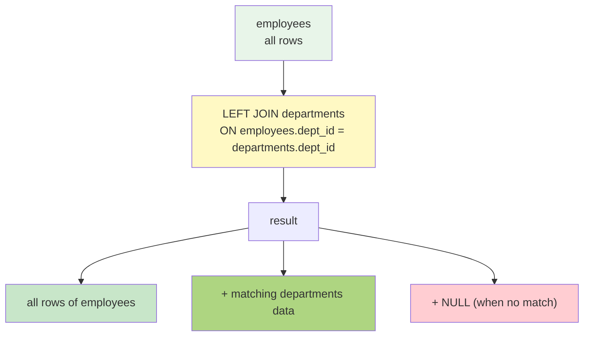
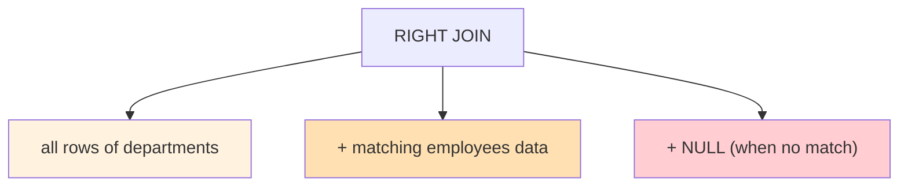
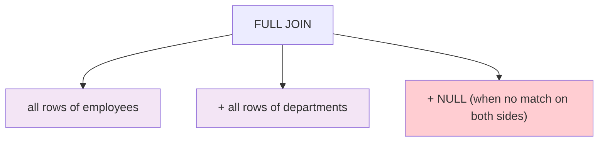
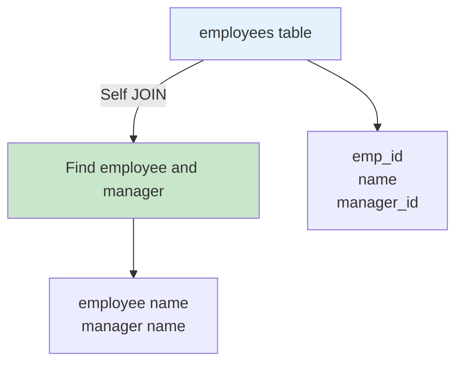
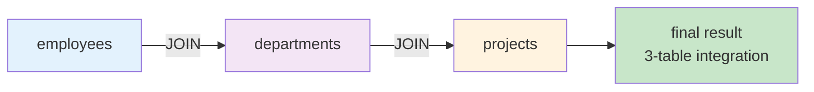
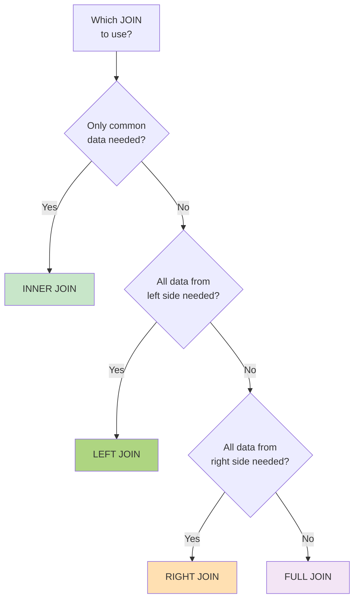

# Chapter 6. JOIN - Advanced

---

## 📖 Class Overview

In this chapter, you will learn advanced concepts of JOIN operations that combine two or more tables in a relational database. Building on the basic INNER JOIN learned in the previous chapter, you will cover various types of JOINs (LEFT JOIN, RIGHT JOIN, FULL OUTER JOIN, CROSS JOIN, Self Join), how to combine multiple tables simultaneously, and performance optimization of JOINs. The goal is to develop the ability to handle complex data query requirements in practice.

이 장에서는 관계형 데이터베이스에서 두 개 이상의 테이블을 결합하는 JOIN 연산의 고급 개념을 학습합니다. 이전 장에서 배운 기본 INNER JOIN을 바탕으로, 다양한 종류의 JOIN(LEFT JOIN, RIGHT JOIN, FULL OUTER JOIN, CROSS JOIN, Self Join)과 여러 테이블을 동시에 결합하는 방법, 그리고 JOIN의 성능 최적화에 대해 다룹니다. 실무에서 복잡한 데이터 조회 요구사항을 처리할 수 있는 능력을 개발하는 것이 목표입니다.

---

## 📚 Part 1: Theoretical Learning

### 🌟 What You'll Learn in This Section

- LEFT JOIN (left outer join)
- RIGHT JOIN (right outer join)
- FULL OUTER JOIN (complete outer join)
- CROSS JOIN (cross join)
- Self Join
- Multiple Table JOIN (3 or more tables)
- JOIN conditions and performance considerations
- Reference - https://blog.naver.com/jadesea0816/223555667283

---

### 6.1 LEFT JOIN (Left Outer Join)

LEFT JOIN maintains all rows from the left table and adds matching rows from the right table. If there are no matching rows from the right table, they are displayed as NULL values.

LEFT JOIN은 왼쪽 테이블의 모든 행을 유지하고, 오른쪽 테이블에서 일치하는 행을 첨가하는 JOIN입니다. 오른쪽 테이블에서 일치하는 행이 없으면 NULL값으로 표시됩니다.

**Syntax :**

```sql
SELECT column_list
FROM table1
LEFT JOIN table2
ON table1.key = table2.key;
```

**Characteristics :**

- All data from the left table is always included in the results (왼쪽 테이블의 모든 데이터는 항상 결과에 포함됨)
- If no match in the right table, displayed as NULL (오른쪽 테이블에서 일치하지 않는 경우 NULL로 표시)
- Very frequently used form in practice (실무에서 매우 자주 사용되는 형태)
- Useful for checking if data is missing (데이터 누락 여부를 확인할 때 유용)

**Example :**

```sql
SELECT e.employee_id, e.name, d.department_name
FROM employees e
LEFT JOIN departments d
ON e.dept_id = d.dept_id;
```



---

### 6.2 RIGHT JOIN (Right Outer Join)

RIGHT JOIN is the opposite of LEFT JOIN. It maintains all rows from the right table and adds matching rows from the left table.

RIGHT JOIN은 LEFT JOIN과 반대로, 오른쪽 테이블의 모든 행을 유지하고 왼쪽 테이블에서 일치하는 행을 첨가합니다.

**Syntax :**

```sql
SELECT column_list
FROM table1
RIGHT JOIN table2
ON table1.key = table2.key;
```

**Characteristics :**

- All data from the right table is always included in the results (오른쪽 테이블의 모든 데이터는 항상 결과에 포함됨)
- If no match in the left table, displayed as NULL (왼쪽 테이블에서 일치하지 않는 경우 NULL로 표시)
- Can get the same result as LEFT JOIN by reversing the table order (LEFT JOIN으로 테이블 순서를 바꾸어 같은 결과를 얻을 수 있음)

**Example :**

```sql
SELECT e.employee_id, e.name, d.department_name
FROM employees e
RIGHT JOIN departments d
ON e.dept_id = d.dept_id;
```



---

### 6.3 FULL OUTER JOIN (Complete Outer Join)

FULL OUTER JOIN maintains all rows from both tables, and displays NULL for parts that do not match.

FULL OUTER JOIN은 양쪽 테이블의 모든 행을 유지하고, 일치하지 않는 부분은 NULL로 표시합니다.

**Important Note :** MySQL does not directly support FULL OUTER JOIN, so it is implemented by combining LEFT JOIN and RIGHT JOIN with UNION.

MySQL은 FULL OUTER JOIN을 직접 지원하지 않으므로, LEFT JOIN과 RIGHT JOIN을 UNION으로 결합하여 구현합니다.

**Implementation Method :**

```sql
SELECT column_list
FROM table1
LEFT JOIN table2 ON table1.key = table2.key
UNION
SELECT column_list
FROM table1
RIGHT JOIN table2 ON table1.key = table2.key;
```



---

### 6.4 CROSS JOIN

CROSS JOIN combines all rows from two tables to create a Cartesian Product.

CROSS JOIN은 두 테이블의 모든 행을 결합하여 카르테시안 곱(Cartesian Product)을 생성합니다.

**Syntax :**

```sql
SELECT column_list
FROM table1
CROSS JOIN table2;
-- or (또는)
SELECT column_list
FROM table1, table2;
```

**Characteristics :**

- Number of result rows = number of rows in table1 × number of rows in table2 (결과 행의 개수 = table1의 행 수 × table2의 행 수)
- Can generate very large result sets (매우 큰 결과셋을 생성할 수 있음)
- Used when all combinations are needed without conditions (조건 없이 모든 조합을 필요할 때 사용)

---

### 6.5 Self Join

Self Join is a join that uses the same table twice to find relationships between rows in the table.

Self Join은 같은 테이블을 두 번 사용하여 테이블의 행들 사이의 관계를 찾는 조인입니다.

**Syntax :**

```sql
SELECT column_list
FROM table1 AS t1
JOIN table1 AS t2
ON t1.key = t2.key;
```

**Use Cases :**

- Finding an employee's superior (manager) (직원의 상급자 관리자 찾기)
- Querying hierarchical data (계층 구조 데이터 조회)
- Finding employees in the same department (동일한 부서의 직원들 찾기)

**Example :**

```sql
SELECT e1.name AS employee_name, e2.name AS manager_name
FROM employees e1
LEFT JOIN employees e2
ON e1.manager_id = e2.employee_id;
```



---

### 6.6 Multiple Table JOIN (3 or More Tables)

In practice, it is common to need to combine 3 or more tables.

실무에서는 3개 이상의 테이블을 결합해야 하는 경우가 빈번합니다.

**Example :**

```sql
SELECT e.name, d.department_name, s.salary_grade
FROM employees e
JOIN departments d ON e.dept_id = d.dept_id
JOIN salary_grades s ON e.salary BETWEEN s.min_salary AND s.max_salary;
```

**Important Points :**

- Write each JOIN condition clearly (각 JOIN 조건을 명확히 작성)
- Order is important when using LEFT JOIN (LEFT JOIN 사용 시 순서가 중요함)
- Improve readability with table aliases (AS) (테이블 별칭 AS로 가독성 향상)



---

### 6.7 JOIN Selection Criteria



---

### 6.8 JOIN Performance Optimization

**Considerations for Performance Improvement (성능 개선을 위한 고려사항):**

1. **Create Appropriate Indexes (적절한 인덱스 생성)**

   - Set index on columns used in JOIN conditions (JOIN 조건에 사용되는 열에 인덱스 설정)
   - Consider index for WHERE condition columns (WHERE 조건의 열도 인덱스 고려)
2. **JOIN Order (JOIN 순서)**

   - JOIN smaller tables first (작은 테이블을 먼저 JOIN)
   - Process tables with fewer results first (결과가 적은 테이블을 먼저 처리)
3. **SELECT Only Required Columns (필요한 열만 SELECT)**

   - Use SELECT with specific columns instead of SELECT * (SELECT * 대신 필요한 열만 명시)
   - Avoid querying unnecessary columns (불필요한 열의 조회 회피)
4. **Specify JOIN Conditions Explicitly (조인 조건 명시)**

   - Use explicit JOIN syntax (INNER JOIN, LEFT JOIN, etc.) (명시적 JOIN 문법 사용)
   - Avoid implicit joins using commas (불명시적 조인 쉼표 사용 회피)

---

## 📚 Part 2: Sample Data

### employees table

```sql
-- Create database (데이터베이스 생성)
CREATE DATABASE ch6_join CHARACTER SET utf8mb4;
USE ch6_join;

-- Create employees table (employees 테이블 생성)
CREATE TABLE employees (
    employee_id INT PRIMARY KEY AUTO_INCREMENT,
    name VARCHAR(50) NOT NULL,
    dept_id INT,
    manager_id INT,
    salary DECIMAL(10, 2)
);

-- Insert employee data (직원 데이터 삽입)
INSERT INTO employees VALUES
(1, 'Kim Chulsu', 1, NULL, 5000000),
(2, 'Lee Younghee', 1, 1, 4000000),
(3, 'Park Minjun', 2, 1, 4500000),
(4, 'Choi Sunsin', 2, 3, 3500000),
(5, 'Kang Gamchan', 3, 1, 4200000),
(6, 'Yi Sunsin', 3, 5, 3800000),
(7, 'Jang Bogo', 1, 1, 3200000);
```

### departments table

```sql
-- Create departments table (departments 테이블 생성)
CREATE TABLE departments (
    dept_id INT PRIMARY KEY AUTO_INCREMENT,
    department_name VARCHAR(50) NOT NULL,
    location VARCHAR(50)
);

-- Insert department data (부서 데이터 삽입)
INSERT INTO departments VALUES
(1, 'Sales Department', 'Seoul'),
(2, 'Technology Department', 'Daejeon'),
(3, 'Human Resources', 'Seoul'),
(4, 'Finance Department', 'Busan');
```

### salary_grades table

```sql
-- Create salary grades table (급여등급 테이블 생성)
CREATE TABLE salary_grades (
    grade CHAR(1) PRIMARY KEY,
    min_salary DECIMAL(10, 2),
    max_salary DECIMAL(10, 2)
);

-- Insert grade data (등급 데이터 삽입)
INSERT INTO salary_grades VALUES
('A', 5000000, 6000000),
('B', 4000000, 4999999),
('C', 3000000, 3999999),
('D', 2000000, 2999999);
```

---

## 💻 Part 3: Hands-on Practice (18 Problems)

### What You'll Learn in This Section

In this section, you will execute the advanced JOIN techniques you learned and write various queries. Starting with practice maintaining all data from one table using LEFT JOIN, finding relationships within tables using Self Join, and generating all combinations using CROSS JOIN, you will develop JOIN skills to respond to various practical situations.

이 섹션에서는 배운 고급 JOIN 기법을 실제로 실행하여 다양한 쿼리를 작성합니다. LEFT JOIN으로 한쪽 테이블의 모든 데이터를 유지하는 실습부터 시작하여, Self Join으로 테이블 내의 관계를 찾고, CROSS JOIN으로 모든 조합을 생성하는 등 다양한 실무 상황에 대응할 수 있는 JOIN 능력을 기르게 됩니다.

```sql
-- =====================================================
-- 6-1~6-5: LEFT JOIN, RIGHT JOIN, Self Join Basics
-- =====================================================

-- 1. LEFT JOIN basics (all employees and department names) (LEFT JOIN 기본 모든 직원과 부서명)
SELECT e.employee_id, e.name, d.department_name
FROM employees e
LEFT JOIN departments d
ON e.dept_id = d.dept_id;

-- 2. LEFT JOIN + WHERE (specific location employees) (LEFT JOIN + WHERE 특정 지역 직원)
SELECT e.employee_id, e.name, d.department_name, d.location
FROM employees e
LEFT JOIN departments d
ON e.dept_id = d.dept_id
WHERE d.location = 'Seoul';

-- 3. RIGHT JOIN + GROUP BY (count of employees per department) (RIGHT JOIN + GROUP BY 모든 부서의 직원 수)
SELECT d.department_name, COUNT(e.employee_id) AS employee_count
FROM employees e
RIGHT JOIN departments d
ON e.dept_id = d.dept_id
GROUP BY d.dept_id, d.department_name;

-- 4. Self Join basics (employee and manager) (Self Join 기본 직원과 상급자)
SELECT e1.name AS employee_name, e2.name AS manager_name
FROM employees e1
LEFT JOIN employees e2
ON e1.manager_id = e2.employee_id;

-- 5. Self Join + WHERE (pairs of employees in same department) (Self Join + WHERE 같은 부서 직원 쌍)
SELECT e1.name AS employee1, e2.name AS employee2, e1.dept_id
FROM employees e1
JOIN employees e2
ON e1.dept_id = e2.dept_id
WHERE e1.employee_id < e2.employee_id;

-- =====================================================
-- 6-6~6-10: CROSS JOIN, Multiple Table JOIN
-- =====================================================

-- 6. CROSS JOIN (all combinations of departments and salary grades) (CROSS JOIN 부서와 급여등급의 모든 조합)
SELECT d.department_name, s.grade
FROM departments d
CROSS JOIN salary_grades s
ORDER BY d.department_name, s.grade;

-- 7. 3-table JOIN (employee, department, salary grade) (3개 테이블 JOIN 직원, 부서, 급여등급)
SELECT e.employee_id, e.name, d.department_name, s.grade
FROM employees e
JOIN departments d
ON e.dept_id = d.dept_id
JOIN salary_grades s
ON e.salary BETWEEN s.min_salary AND s.max_salary;

-- 8. LEFT JOIN chaining (employee, department, location) (LEFT JOIN 체이닝 직원, 부서, 위치)
SELECT e.employee_id, e.name, d.department_name, d.location
FROM employees e
LEFT JOIN departments d
ON e.dept_id = d.dept_id
ORDER BY e.employee_id;

-- 9. JOIN + GROUP BY (count of employees per department) (JOIN + GROUP BY 부서별 직원 수)
SELECT d.department_name, COUNT(e.employee_id) AS employee_count
FROM employees e
JOIN departments d
ON e.dept_id = d.dept_id
GROUP BY d.dept_id, d.department_name;

-- 10. JOIN + DISTINCT (remove duplicates) (JOIN + DISTINCT 중복 제거)
SELECT DISTINCT d.department_name
FROM employees e
JOIN departments d
ON e.dept_id = d.dept_id;

-- =====================================================
-- 6-11~6-18: Advanced Functions (ORDER BY, LIMIT, CASE, aggregate functions, etc.)
-- =====================================================

-- 11. JOIN + ORDER BY (multiple column sorting) (JOIN + ORDER BY 다중 열 정렬)
SELECT e.name, d.department_name, e.salary
FROM employees e
JOIN departments d
ON e.dept_id = d.dept_id
ORDER BY d.department_name ASC, e.salary DESC;

-- 12. JOIN + LIMIT (top 5 rows) (JOIN + LIMIT 상위 5개 행)
SELECT e.name, e.salary, d.department_name
FROM employees e
JOIN departments d
ON e.dept_id = d.dept_id
ORDER BY e.salary DESC
LIMIT 5;

-- 13. JOIN + CASE statement (classify salary levels) (JOIN + CASE 문 급여 레벨 분류)
SELECT e.name, d.department_name,
       CASE 
           WHEN e.salary >= 5000000 THEN 'High'
           WHEN e.salary >= 4000000 THEN 'Medium'
           ELSE 'Low'
       END AS salary_level
FROM employees e
JOIN departments d
ON e.dept_id = d.dept_id;

-- 14. JOIN + aggregate functions (department aggregates) (JOIN + 집계함수 부서별 집계)
SELECT d.department_name, 
       COUNT(e.employee_id) AS emp_count,
       AVG(e.salary) AS avg_salary,
       MAX(e.salary) AS max_salary
FROM employees e
JOIN departments d
ON e.dept_id = d.dept_id
GROUP BY d.dept_id, d.department_name;

-- 15. FULL OUTER JOIN (LEFT + RIGHT UNION) (FULL OUTER JOIN LEFT + RIGHT UNION)
SELECT COALESCE(e.employee_id, 0) AS emp_id,
       COALESCE(e.name, 'None') AS emp_name,
       COALESCE(d.department_name, 'None') AS dept_name
FROM employees e
LEFT JOIN departments d
ON e.dept_id = d.dept_id
UNION
SELECT COALESCE(e.employee_id, 0) AS emp_id,
       COALESCE(e.name, 'None') AS emp_name,
       COALESCE(d.department_name, 'None') AS dept_name
FROM employees e
RIGHT JOIN departments d
ON e.dept_id = d.dept_id;

-- 16. Self Join + range query (salary grade range) (Self Join + 범위 조회 급여등급 간 범위)
SELECT s1.grade AS current_grade, s2.grade AS next_grade
FROM salary_grades s1
JOIN salary_grades s2
ON s1.max_salary < s2.min_salary;

-- 17. JOIN + ORDER BY (multiple sorting) (JOIN + ORDER BY 다중 정렬)
SELECT e.name, e.salary, d.department_name
FROM employees e
JOIN departments d
ON e.dept_id = d.dept_id
ORDER BY e.salary DESC, e.name ASC;

-- 18. JOIN + string function (CONCAT) (JOIN + 문자열 함수 CONCAT)
SELECT CONCAT(e.name, ' - ', d.department_name) AS employee_info,
       e.salary
FROM employees e
JOIN departments d
ON e.dept_id = d.dept_id;
```

---

## 📝 Part 4: Assignment Guidelines

### Theoretical Assignments

**Assignment 1**: Explain the differences between LEFT JOIN and RIGHT JOIN, and describe when each should be used with practical examples. Also show how to implement the same results using both LEFT JOIN and RIGHT JOIN.

LEFT JOIN과 RIGHT JOIN의 차이점을 설명하고, 언제 각각을 사용해야 하는지 실무 사례를 들어 서술하세요. 같은 결과를 LEFT JOIN과 RIGHT JOIN으로 구현하는 방법도 보여주세요.

**Assignment 2**: Explain the concept of Self Join and present 3 or more cases where Self Join is needed, such as employee-manager relationships and category parent-child relationships.

Self Join의 개념을 설명하고, 직원과 관리자 관계, 범주 대분류와 소분류 관계 등 Self Join이 필요한 사례를 3가지 이상 제시하세요.

**Assignment 3**: Explain how to implement FULL OUTER JOIN in MySQL and write implementation queries using LEFT JOIN, RIGHT JOIN, and UNION. Analyze situations where FULL OUTER JOIN is necessary.

FULL OUTER JOIN을 MySQL에서 구현하는 방법을 설명하고, LEFT JOIN, RIGHT JOIN, UNION을 사용한 구현 쿼리를 작성하세요. FULL OUTER JOIN이 필요한 상황을 분석하세요.

**Assignment 4**: Describe considerations when joining 3 or more tables. Discuss precautions when connecting multiple LEFT JOINs and methods for performance optimization.

3개 이상의 테이블을 JOIN할 때 고려해야 할 사항들을 서술하세요. 여러 LEFT JOIN을 연결할 때의 주의사항과 성능 최적화 방법을 논의하세요.

**Assignment 5**: Explain factors that affect JOIN performance (indexes, join order, join conditions) and present optimization methods for each. Also explain actual performance measurement methods.

JOIN의 성능에 영향을 미치는 요소들(인덱스, 조인 순서, 조인 조건)을 설명하고, 각각의 최적화 방법을 제시하세요. 실제 성능 측정 방법도 설명하세요.

**Submission Format**: Word or PDF document (2-3 pages)

제출 형식: Word 또는 PDF 문서 (2-3페이지)

---

### Practical Assignments

**Assignment 1**: Write a query to join 3 or more tables from the sample database to query the following information: employee name, department name, department location, salary, salary grade. All employees must be included in the results.

샘플 데이터베이스에서 3개 이상의 테이블을 JOIN하여 다음 정보를 조회하는 쿼리를 작성하세요: 직원명, 부서명, 부서 위치, 급여, 급여 등급. 모든 직원이 결과에 포함되어야 합니다.

**Assignment 2**: Self Join the employees table to query the following:

employees 테이블을 Self Join하여 다음을 조회하세요:

- Each employee and their superior's name (각 직원과 그 직원의 상급자명)
- All pairs of employees in the same department (같은 부서의 모든 직원 쌍)
- Department heads (manager_id is NULL) and their subordinates (부서장 manager_id가 NULL와 그 부하직원들)

**Assignment 3**: Use LEFT JOIN and HAVING to perform the following queries:

LEFT JOIN과 HAVING을 사용하여 다음 조회를 수행하세요:

- Count of employees per department (departments with no employees included) (부서별 직원 수 직원이 없는 부서도 포함)
- Filter only departments with 5 or more employees (직원이 5명 이상인 부서만 필터링)
- Sort results in ascending order by department name (결과를 부서명의 오름차순으로 정렬)

**Assignment 4**: Use NOT EXISTS and LEFT JOIN to query the following:

NOT EXISTS와 LEFT JOIN을 사용하여 다음을 조회하세요:

- Employees not assigned to a specific project (특정 프로젝트에 배정되지 않은 직원)
- Unapproved requests (승인되지 않은 요청)
- Parent categories with no subcategories (하위 카테고리가 없는 상위 카테고리)

**Assignment 5**: Execute all queries provided from Practice 6-1 to 6-18 in Part 3 directly and attach screenshots of each query result. Additionally, create 5 or more creative JOIN queries, present their results, and explain the purpose and usage of each query.

Part 3의 실습 6-1부터 6-18까지 제공된 모든 쿼리를 직접 실행하고, 각 쿼리의 결과를 스크린샷으로 첨부하세요. 추가로 5개 이상의 창의적인 JOIN 쿼리를 작성하여 그 결과도 함께 제시하고, 각 쿼리의 목적과 활용 사례를 설명하세요.

**Submission Format**: SQL file (Ch6_JOIN_Advanced_[StudentID].sql) and result screenshots

제출 형식: SQL 파일 (Ch6_JOIN_Advanced_[학번].sql) 및 결과 스크린샷

---

Thank you for your attention.   
Cho Jeonghyun ([peterchokr@gmail.com](mailto:peterchokr@gmail.com)). Yeungnam University College

"Produced in collaboration with Claude and Gemini."
