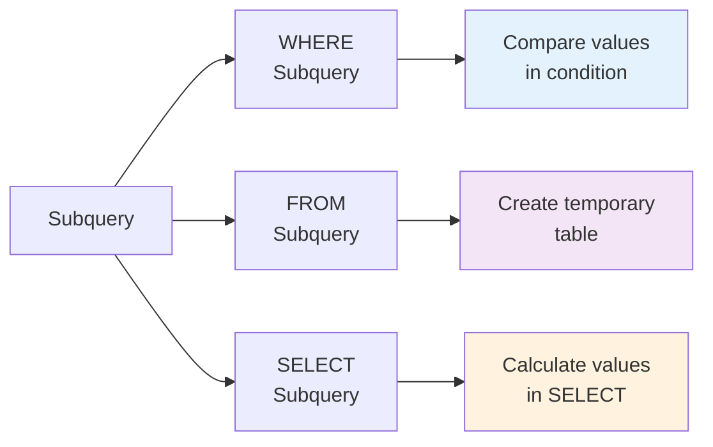

# Chapter 8. Subquery

---

## 📖 Class Overview

In this chapter, you will learn subqueries, which are queries contained within other queries. Subquery is a powerful tool in SQL that allows you to solve complex data retrieval requirements step by step. You will learn various forms of subqueries including scalar subqueries, inline views, correlated subqueries, and EXISTS, as well as performance comparisons with JOINs.

이 장에서는 다른 쿼리 내에 포함된 쿼리인 서브쿼리(Subquery)를 학습합니다.    
서브쿼리는 SQL의 강력한 도구로, 복잡한 데이터 검색 요구사항을 단계적으로 해결할 수 있게 합니다. 스칼라 서브쿼리, 인라인 뷰, 상관 서브쿼리, EXISTS 등 다양한 형태의 서브쿼리와 JOIN과의 성능 비교를 다룹니다.

---

## 📚 Part 1: Theoretical Learning

### 🌟 What You'll Learn in This Section

- Concept and classification of subqueries (서브쿼리의 개념과 분류)
- Single-row and multi-row subqueries (단일 행 서브쿼리와 다중 행 서브쿼리)
- Scalar subqueries and inline views (스칼라 서브쿼리와 인라인 뷰)
- Correlated subqueries - concept and usage (상관 서브쿼리의 개념과 활용)
- Difference between EXISTS and IN (EXISTS와 IN의 차이점)
- Subquery performance optimization (서브쿼리 성능 최적화)

---

### 8.1 Basic Concept of Subquery

A subquery is a SELECT statement contained within another query.

서브쿼리는 다른 쿼리 내에 포함된 SELECT 문입니다.

**Characteristics (특징):**

- Written inside parentheses () (괄호 () 안에 작성)
- Often executed before the main query (inner query) (메인 쿼리보다 먼저 실행되는 경우가 많음 내부 쿼리)
- Results are used by the main query (결과를 메인 쿼리가 사용)

**Usage Locations (사용 위치):**

```sql
SELECT ... (SELECT ... ) FROM ...    -- SELECT clause
FROM (SELECT ... ) AS alias_name     -- FROM clause
WHERE column IN (SELECT ... )        -- WHERE clause
```



---

### 8.2 Single-Row Subquery

A single-row subquery returns exactly one row.

단일 행 서브쿼리는 정확히 하나의 행을 반환하는 서브쿼리입니다.

**Syntax (문법):**

```sql
SELECT * FROM employees
WHERE salary = (SELECT MAX(salary) FROM employees);
```

**Characteristics (특징):**

- Can use comparison operators (=, >, <, >=, <=, !=) (비교 연산자 사용 가능)
- Usually includes aggregate functions (집계함수를 주로 포함)
- Better performance than multi-row subqueries (다중 행 서브쿼리보다 성능이 좋음)

**Example (예시):**

```sql
-- Find employees with higher salary than average (평균 급여보다 높은 직원 찾기)
SELECT * FROM employees
WHERE salary > (SELECT AVG(salary) FROM employees);

-- Employees with same salary as max in dept 1 (특정 부서의 최대 급여와 같은 급여를 받는 직원)
SELECT * FROM employees
WHERE salary = (SELECT MAX(salary) FROM employees WHERE dept_id = 1);
```

---

### 8.3 Multi-Row Subquery

A multi-row subquery returns one or more rows.

다중 행 서브쿼리는 하나 이상의 행을 반환하는 서브쿼리입니다.

**Required Operators (필요한 연산자):**

- IN: Matches one of the subquery results (서브쿼리 결과 중 하나와 일치)
- NOT IN: Does not match any subquery result (서브쿼리 결과 중 하나와도 일치하지 않음)
- ANY: Compares with any subquery result (서브쿼리 결과 중 하나와 비교)
- ALL: Compares with all subquery results (서브쿼리 결과의 모든 값과 비교)

**Example (예시):**

```sql
-- Employees with same salary as dept 1 employees (부서 1에 속한 직원의 급여와 같은 급여를 받는 모든 직원)
SELECT * FROM employees
WHERE salary IN (SELECT salary FROM employees WHERE dept_id = 1);

-- Employees with salary higher than any dept average (각 부서 평균 급여보다 높은 직원)
SELECT * FROM employees
WHERE salary > ANY (SELECT AVG(salary) FROM employees GROUP BY dept_id);
```

---

### 8.4 Scalar Subquery

A scalar subquery returns a single value in the SELECT clause.

스칼라 서브쿼리는 SELECT 절에서 단일 값을 반환하는 서브쿼리입니다.

**Syntax (문법):**

```sql
SELECT column, (SELECT ... FROM ...) AS alias
FROM table_name;
```

**Characteristics (특징):**

- Can be executed for each row (각 행마다 실행될 수 있음)
- Performance may degrade if correlated (상관 서브쿼리일 경우 성능이 저하될 수 있음)
- Can be replaced with JOIN for better performance (JOIN으로 대체하면 성능 향상 가능)

**Example (예시):**

```sql
SELECT employee_id, name, 
       (SELECT department_name FROM departments d 
        WHERE d.dept_id = e.dept_id) AS dept_name
FROM employees e;
```

---

### 8.5 Inline View

An inline view is a subquery used in the FROM clause.

인라인 뷰는 FROM 절에 사용되는 서브쿼리입니다.

**Syntax (문법):**

```sql
SELECT * FROM (
  SELECT column FROM table_name WHERE condition
) AS alias_name;
```

**Characteristics (특징):**

- Works like a temporary table (임시 테이블처럼 동작)
- Alias is required (별칭 필수)
- Processes complex queries step-by-step (복잡한 쿼리를 단계적으로 처리)

**Example (예시):**

```sql
-- Get average salary by department, then find employees above average (부서별 평균 급여를 구한 후, 평균 이상의 직원을 찾기)
SELECT e.name, dept_avg.avg_salary
FROM employees e
JOIN (SELECT dept_id, AVG(salary) AS avg_salary 
      FROM employees GROUP BY dept_id) AS dept_avg
ON e.dept_id = dept_avg.dept_id
WHERE e.salary >= dept_avg.avg_salary;
```

---

### 8.6 Correlated Subquery

A correlated subquery references values from the outer query.

상관 서브쿼리는 외부 쿼리의 값을 참조하는 서브쿼리입니다.

**Characteristics (특징):**

- Subquery executes for each row of outer query (외부 쿼리의 각 행에 대해 서브쿼리가 실행)
- Performance may degrade (성능이 저하될 수 있음)
- Logic can be complex (로직이 복잡할 수 있음)

**Example (예시):**

```sql
-- Check if each employee salary is higher than department average (각 직원의 급여가 같은 부서의 평균 급여보다 높은지 확인)
SELECT name, salary
FROM employees e1
WHERE salary > (SELECT AVG(salary) FROM employees e2 
                WHERE e2.dept_id = e1.dept_id);
```

---

### 8.7 EXISTS and NOT EXISTS

EXISTS checks if a subquery returns any rows.

EXISTS는 서브쿼리가 행을 반환하는지 확인합니다.

**Syntax (문법):**

```sql
SELECT * FROM table1
WHERE EXISTS (SELECT 1 FROM table2 WHERE condition);
```

**Characteristics (특징):**

- Only checks existence, not actual data (실제 데이터보다 존재 여부만 확인)
- May have better performance than IN (IN보다 성능이 좋을 수 있음)
- Different NULL value handling (NULL 값 처리가 다름)

**Example (예시):**

```sql
-- Find customers with at least one order (최소 하나의 주문이 있는 고객 찾기)
SELECT * FROM customers c
WHERE EXISTS (SELECT 1 FROM orders o WHERE o.customer_id = c.customer_id);

-- Find customers with no orders (주문이 없는 고객 찾기)
SELECT * FROM customers c
WHERE NOT EXISTS (SELECT 1 FROM orders o WHERE o.customer_id = c.customer_id);
```

---

### 8.8 Subquery vs JOIN

The same result can be achieved with either a subquery or a JOIN.

동일한 결과를 서브쿼리와 JOIN으로 구현할 수 있습니다.

**Subquery (서브쿼리):**

```sql
SELECT * FROM employees
WHERE dept_id IN (SELECT dept_id FROM departments WHERE location = 'Seoul');
```

**JOIN:**

```sql
SELECT e.* FROM employees e
JOIN departments d ON e.dept_id = d.dept_id
WHERE d.location = 'Seoul';
```

**Performance Considerations (성능 고려사항):**

- Generally JOIN is faster (일반적으로 JOIN이 더 빠름)
- Consider readability when subquery is clearer (서브쿼리가 명확한 경우 가독성 우선 고려)
- Actual performance depends on query optimizer (실제 성능은 쿼리 옵티마이저에 따라 다름)

---

### 8.9 WITH (CTE: Common Table Expression)

WITH allows you to write complex queries with better readability using Common Table Expressions.

WITH를 사용한 공통 테이블 표현식은 복잡한 쿼리를 가독성 있게 작성합니다.

**Syntax (문법):**

```sql
WITH cte_name AS (
  SELECT column FROM table_name WHERE condition
)
SELECT * FROM cte_name;
```

**Characteristics (특징):**

- Works like a temporary view (임시 뷰처럼 동작)
- Can be referenced multiple times (여러 번 참조 가능)

---

## 📚 Part 2: Sample Data

### Essential Table Structure (필수 테이블 구성)

```sql
-- Create database (데이터베이스 생성)
CREATE DATABASE ch8_subq CHARACTER SET utf8mb4;
USE ch8_subq;

-- Create employees table (employees 테이블 생성)
CREATE TABLE employees (
    employee_id INT PRIMARY KEY AUTO_INCREMENT,
    name VARCHAR(50),
    dept_id INT,
    salary DECIMAL(10, 2),
    hire_date DATE
);

-- Insert employee data (직원 데이터 삽입)
INSERT INTO employees VALUES
(1, 'Kim Chulsu', 1, 5000000, '2020-01-15'),
(2, 'Lee Younghee', 1, 4000000, '2020-06-20'),
(3, 'Park Minjun', 2, 4500000, '2019-03-10'),
(4, 'Choi Sunsin', 2, 3500000, '2021-07-15'),
(5, 'Kang Gamchan', 3, 4200000, '2020-09-05');

-- Create departments table (departments 테이블 생성)
CREATE TABLE departments (
    dept_id INT PRIMARY KEY AUTO_INCREMENT,
    department_name VARCHAR(50),
    location VARCHAR(50)
);

-- Insert department data (부서 데이터 삽입)
INSERT INTO departments VALUES
(1, 'Sales', 'Seoul'),
(2, 'Technology', 'Daejeon'),
(3, 'Human Resources', 'Seoul'),
(4, 'Finance', 'Busan');

-- Create customers table (customers 테이블 생성)
CREATE TABLE customers (
    customer_id INT PRIMARY KEY AUTO_INCREMENT,
    name VARCHAR(50)
);

-- Create orders table (orders 테이블 생성)
CREATE TABLE orders (
    order_id INT PRIMARY KEY AUTO_INCREMENT,
    customer_id INT,
    order_date DATE,
    total_amount DECIMAL(10, 2)
);
```

---

## 💻 Part 3: Hands-on Practice (20 Problems)

### What You'll Learn in This Section

In this section, you will write and execute various forms of subqueries you learned. Starting from basic single-row subqueries, you will progress through multi-row subqueries, scalar subqueries, correlated subqueries, EXISTS, and WITH (CTE), developing subquery skills necessary for practice.

이 섹션에서는 배운 서브쿼리의 다양한 형태를 실제로 작성하고 실행합니다. 기본 단일 행 서브쿼리부터 시작하여, 다중 행 서브쿼리, 스칼라 서브쿼리, 상관 서브쿼리, EXISTS, WITH (CTE)까지 실무에서 필요한 서브쿼리 능력을 기르게 됩니다.

```sql
-- =====================================================
-- 8-1~8-6: Single-row and Multi-row Subqueries
-- =====================================================

-- 1. Single-row subquery - MAX (employee with highest salary) (단일 행 서브쿼리 최대값 최고 급여 직원)
SELECT * FROM employees
WHERE salary = (SELECT MAX(salary) FROM employees);

-- 2. Single-row subquery - AVG (employees with above average salary) (단일 행 서브쿼리 평균값 평균 급여보다 높은 직원)
SELECT name, salary FROM employees
WHERE salary > (SELECT AVG(salary) FROM employees);

-- 3. Single-row subquery - specific dept (max salary in dept 1) (단일 행 서브쿼리 특정 부서 부서 1 최대 급여)
SELECT * FROM employees
WHERE salary = (SELECT MAX(salary) FROM employees WHERE dept_id = 1);

-- 4. Multi-row subquery - IN (employees with salary in dept 1,2) (다중 행 서브쿼리 IN 부서 1,2의 급여와 같은 직원)
SELECT * FROM employees
WHERE salary IN (SELECT salary FROM employees WHERE dept_id IN (1, 2));

-- 5. Multi-row subquery - NOT IN (employees with salary not in dept 1) (다중 행 서브쿼리 NOT IN 부서 1의 급여와 다른 직원)
SELECT * FROM employees
WHERE salary NOT IN (SELECT salary FROM employees WHERE dept_id = 1);

-- 6. Multi-row subquery - ANY (salary higher than any dept average) (다중 행 서브쿼리 ANY 각 부서 평균보다 높은 급여)
SELECT name, salary, dept_id FROM employees
WHERE salary > ANY (SELECT AVG(salary) FROM employees GROUP BY dept_id);

-- =====================================================
-- 8-7~8-10: Scalar Subqueries and Inline Views
-- =====================================================

-- 7. Scalar subquery (each employee's dept average salary) (스칼라 서브쿼리 각 직원의 부서 평균 급여)
SELECT name, salary,
       (SELECT AVG(salary) FROM employees e2 WHERE e2.dept_id = e1.dept_id) AS dept_avg
FROM employees e1;

-- 8. Scalar subquery - get dept name (add department name) (스칼라 서브쿼리 부서명 추가)
SELECT name,
       (SELECT department_name FROM departments WHERE dept_id = e.dept_id) AS dept_name
FROM employees e;

-- 9. Inline view - basics (dept average salary, 4000000 or more) (인라인 뷰 기본 부서별 평균 급여 400만 이상)
SELECT dept_id, dept_avg FROM (
    SELECT dept_id, AVG(salary) AS dept_avg
    FROM employees
    GROUP BY dept_id
) AS dept_salary
WHERE dept_avg > 4000000;

-- 10. Inline view - sort and filter (high salary first, >4000000) (인라인 뷰 정렬 및 필터링 급여 높은 순 400만 이상)
SELECT * FROM (
    SELECT name, salary FROM employees ORDER BY salary DESC
) AS sorted_emp
WHERE salary > 4000000;

-- =====================================================
-- 8-11~8-14: Correlated Subqueries and EXISTS
-- =====================================================

-- 11. Correlated subquery - comparison (compare with dept average) (상관 서브쿼리 비교 부서 평균과 비교)
SELECT name, salary,
       CASE WHEN salary > (SELECT AVG(salary) FROM employees e2 WHERE e2.dept_id = e1.dept_id)
            THEN 'Above Average' ELSE 'Below Average' END AS salary_level
FROM employees e1;

-- 12. Correlated subquery - COUNT (number of employees in same dept) (상관 서브쿼리 COUNT 같은 부서 직원 수)
SELECT name,
       (SELECT COUNT(*) FROM employees e2 WHERE e2.dept_id = e1.dept_id) AS dept_count
FROM employees e1;

-- 13. EXISTS basics (customers with orders) (EXISTS 기본 주문이 있는 고객)
SELECT customer_id FROM customers c
WHERE EXISTS (SELECT 1 FROM orders o WHERE o.customer_id = c.customer_id);

-- 14. NOT EXISTS (customers without orders) (NOT EXISTS 주문이 없는 고객)
SELECT customer_id FROM customers c
WHERE NOT EXISTS (SELECT 1 FROM orders o WHERE o.customer_id = c.customer_id);

-- =====================================================
-- 8-15~8-20: Nested Queries, Comparisons, and Advanced Subqueries
-- =====================================================

-- 15. Subquery vs JOIN (employees in Seoul dept) (서브쿼리 vs JOIN 서울 부서 직원)
SELECT name FROM employees
WHERE dept_id IN (SELECT dept_id FROM departments WHERE location = 'Seoul');

-- 16. Nested subquery (salary higher than Seoul dept average) (중첩 서브쿼리 서울 부서 평균보다 높은 급여)
SELECT name FROM employees
WHERE salary > (SELECT AVG(salary) FROM employees
                WHERE dept_id IN (SELECT dept_id FROM departments WHERE location = 'Seoul'));

-- 17. Aggregate functions with subquery (statistics query) (집계함수와 서브쿼리 통계 조회)
SELECT (SELECT COUNT(*) FROM employees) AS total_emp,
       (SELECT AVG(salary) FROM employees) AS avg_salary,
       (SELECT MAX(salary) FROM employees) AS max_salary;

-- 18. Dynamic WHERE with subquery (same dept as Kim Chulsu) (서브쿼리 동적 WHERE 김철수와 같은 부서)
SELECT * FROM employees
WHERE dept_id = (SELECT dept_id FROM employees WHERE name = 'Kim Chulsu');

-- 19. WITH (CTE) - dept average (부서별 평균)
WITH dept_avg AS (
    SELECT dept_id, AVG(salary) AS avg_salary FROM employees GROUP BY dept_id
)
SELECT e.name, e.salary, d.avg_salary
FROM employees e
JOIN dept_avg d ON e.dept_id = d.dept_id;

-- 20. Subquery - ranking (calculate row-by-row ranking) (서브쿼리 순위 매기기 행별 순위 계산)
SELECT name, salary,
       (SELECT COUNT(*) FROM employees e2 WHERE e2.salary > e1.salary) + 1 AS ranking
FROM employees e1;
```

---

## 📝 Part 4: Assignment Guidelines

### Theoretical Assignments

**Assignment 1**: Explain the characteristics and when to use single-row subqueries, multi-row subqueries, and scalar subqueries. Present 3 or more practical use cases for each.

단일 행 서브쿼리, 다중 행 서브쿼리, 스칼라 서브쿼리의 특징과 사용 시기를 설명하세요. 각각의 실무 활용 사례를 3가지 이상 제시하세요.

**Assignment 2**: Explain the concept of correlated subqueries and describe the differences in execution methods. Discuss situations where performance issues may occur and present solutions.

상관 서브쿼리의 개념을 설명하고, 실행 방식의 차이점을 설명하세요. 성능 문제가 발생할 수 있는 상황과 해결 방법을 논의하세요.

**Assignment 3**: Explain the differences between EXISTS and IN. Analyze performance characteristics and NULL value handling differences to establish selection criteria.

EXISTS와 IN의 차이점을 설명하세요. 각각의 성능 특성과 NULL 값 처리 방식의 차이를 분석하여 선택 기준을 제시하세요.

**Assignment 4**: Subqueries and JOINs can produce the same results. Compare advantages and disadvantages of each, and explain which to choose in terms of performance.

서브쿼리와 JOIN으로 같은 결과를 얻을 수 있습니다. 각각의 장단점을 비교하고, 성능 측면에서 어떤 경우 어느 것을 선택해야 하는지 설명하세요.

**Assignment 5**: Explain the differences between WITH (CTE) and subqueries. Describe the concept of recursive CTE and present use cases, as well as methods to handle complex hierarchical data.

WITH (CTE)와 서브쿼리의 차이점을 설명하세요. 재귀 CTE의 개념과 활용 사례를 제시하고, 복잡한 계층 구조 데이터를 처리하는 방법을 서술하세요.

**Submission Format**: Word or PDF document (2-3 pages)

제출 형식: Word 또는 PDF 문서 (2-3페이지)

---

### Practical Assignments

**Assignment 1**: Write various types of subqueries:

다양한 형태의 서브쿼리를 작성하세요:

- Use single-row subquery to retrieve data equal to a specific value (단일 행 서브쿼리로 특정 값과 같은 데이터 조회)
- Use multi-row subquery to retrieve data matching one of several values (다중 행 서브쿼리로 여러 값 중 하나와 일치하는 데이터 조회)
- Use scalar subquery to display related information for each row (스칼라 서브쿼리로 각 행에 함께 표시할 정보 조회)

**Assignment 2**: Write correlated subqueries:

상관 서브쿼리를 작성하세요:

- Correlated subquery comparing with group average (각 그룹의 평균과 비교하는 상관 서브쿼리)
- Correlated subquery comparing with other rows in same group (같은 그룹 내 다른 행과 비교하는 상관 서브쿼리)
- Correlated subquery with multiple conditions (복수 조건의 상관 서브쿼리)

**Assignment 3**: Use EXISTS and NOT EXISTS:

EXISTS와 NOT EXISTS를 사용하세요:

- Check if data satisfying a specific condition exists (특정 조건을 만족하는 데이터가 존재하는지 확인)
- Retrieve data where a specific condition is not satisfied (특정 조건을 만족하는 데이터가 없는 것을 조회)
- Use NOT EXISTS for anti-join (NOT EXISTS를 사용한 안티조인)

**Assignment 4**: Get same results with subquery and JOIN, then compare performance:

서브쿼리와 JOIN으로 같은 결과를 얻고 성능을 비교하세요:

- Write same query using subquery and JOIN (서브쿼리와 JOIN으로 같은 쿼리를 작성)
- Compare execution plans using EXPLAIN command (EXPLAIN 명령어로 실행 계획 비교)
- Analyze performance differences and explain selection reason (성능 차이를 분석하고 선택 이유를 설명)

**Assignment 5**: Execute all queries provided from Practice 8-1 to 8-20 in Part 3 directly and attach screenshots of each query result. Additionally, create 5 or more creative subqueries, present their results, and explain the purpose and practical application method of each query.

Part 3의 실습 8-1부터 8-20까지 제공된 모든 쿼리를 직접 실행하고, 각 쿼리의 결과를 스크린샷으로 첨부하세요. 추가로 5개 이상의 창의적인 서브쿼리를 작성하여 그 결과를 제시하고, 각 쿼리의 목적과 실무 활용 방법을 설명하세요.

**Submission Format**: SQL file (Ch8_Subquery_[StudentID].sql) and result screenshots

제출 형식: SQL 파일 (Ch8_Subquery_[학번].sql) 및 결과 스크린샷

---

Thank you for your attention.

Cho Jeonghyun (peterchokr@gmail.com). Yeungnam University College
